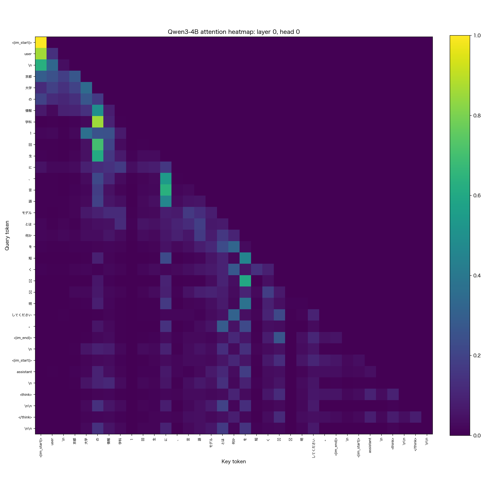

# Setup と基本 probe — scripts 00–06

Scripts:
- [`scripts/00_env_check.py`](../scripts/00_env_check.py)
- [`scripts/01_download_model.py`](../scripts/01_download_model.py)
- [`scripts/02_tokenizer_probe.py`](../scripts/02_tokenizer_probe.py)
- [`scripts/03_generate_smoke.py`](../scripts/03_generate_smoke.py)
- [`scripts/04_probe_forward.py`](../scripts/04_probe_forward.py)
- [`scripts/05_show_transformers_source.py`](../scripts/05_show_transformers_source.py)
- [`scripts/06_attention_heatmap.py`](../scripts/06_attention_heatmap.py)

最終更新: 2026-05-21
ステータス: ✅ 講義デモ前の事前探査・セットアップを完了。

---

## 1. このドキュメントの位置づけ

このリポジトリ ([qwen3_4b_probe](../README.md)) では、Qwen3-4B の内部状態を Hugging Face Transformers の既存 API で観察することが目的です。最終的な配布物は [notebooks/](../notebooks/) の 3 本（nb00 chat 入門 / nb01 tokenizer / nb02 residual stream + logit lens + patching）ですが、それを書くまでに行った **事前探査・セットアップ系の scripts 00–06** が本 md の対象です。

scripts 00–06 は CLAUDE.md でいう「core scripts」に該当し、`llm2026` venv で動作します。番号には依存関係の意味があります：

```text
00 → 01 → 02 → 03 → 04 → 06
            ↑           └── attention 可視化
            └── token テーブル
05 は補助（独立、いつ実行してもよい）
```

`04` は forward 結果を `outputs/probe_forward_compact.pt` に保存し、`06` がそれを読み込むという連携になっています。

> **note**: 数値結果は 2026-05 時点のスナップショット（[`scripts/00_env_check.py`](../scripts/00_env_check.py) によると torch 2.11.0 / transformers 5.8.0 / Python 3.12.3、macOS arm64、MPS）に基づきます。再実行で多少変わる可能性があります。

---

## 2. 全 scripts の共通設定

設定は [`scripts/qwen3_4b_probe.json`](../scripts/qwen3_4b_probe.json) に集約されています。

```json
{
  "workspace_name": "qwen3_4b_probe",
  "model_id": "Qwen/Qwen3-4B",
  "default_prompt": "京都大学の情報学科1回生に、言語モデルとは何かを短く説明してください。",
  "max_new_tokens": 64,
  "attn_implementation": "eager",
  "output_hidden_states": true,
  "output_attentions": true,
  "use_cache": false
}
```

ポイント:

- **`attn_implementation = "eager"`** : `output_attentions=True` で attention weights を取り出すために必要。`sdpa` などの高速化実装ではこの形では返ってきません。
- **`output_hidden_states / output_attentions = True`** : 内部観察のため両方を保存します（メモリは消費します）。
- **`use_cache = False`** : KV cache が無効。短い prompt の単発 forward だけなら高速化メリットも無いため off。
- **`default_prompt`** : 35 token になる短い日本語プロンプト。Chapter 2 で展開します。

scripts 共通ユーティリティは [`scripts/common.py`](../scripts/common.py) にあり、主に以下を提供します:

- `load_config()` — 上記 json を辞書として返す
- `resolve_outputs_dir()` — workspace 直下 `outputs/` を返す（無ければ作成）

---

## 3. Chapter 00 — 環境確認

Script: [`scripts/00_env_check.py`](../scripts/00_env_check.py)

### 目的

Python、PyTorch、Transformers、Hugging Face Hub のバージョンと MPS/CUDA の利用可否を 1 画面で確認します。「再現性が問題になったときに、まずどの環境で動いていたか」を残すための最小ログ。

### 実装の要点

`platform`, `torch`, `transformers`, `huggingface_hub` から `__version__` 等を直接 print するだけ。**model のロードは行いません**（環境確認のみで重い処理をしないのがポイント）。

### 結果 — [outputs/env_check.txt](../outputs/env_check.txt)

```text
python: 3.12.3
platform: macOS-26.3.1-arm64-arm-64bit
torch: 2.11.0
transformers: 5.8.0
huggingface_hub: 1.14.0
mps built: True
mps available: True
cuda available: False
workspace: ~/.../qwen3_4b_probe
model_id: Qwen/Qwen3-4B
```

→ M4 Mac の MPS バックエンド利用、CUDA 無し。以降の script は全てこの環境で実行されました。

---

## 4. Chapter 01 — モデルのダウンロード

Script: [`scripts/01_download_model.py`](../scripts/01_download_model.py)

### 目的

Qwen3-4B の重みを Hugging Face cache に取得します。**初回セットアップ時に 1 回だけ実行**するもの。2 回目以降は cache が使われます。

### 実装の要点

`huggingface_hub.snapshot_download(repo_id="Qwen/Qwen3-4B")` を呼ぶだけ。CLAUDE.md の方針通り、**通常の probe / 解析 script に暗黙のダウンロード処理は仕込まず**、download は専用 script に切り出されています。

### 結果 — [outputs/download_model.txt](../outputs/download_model.txt)

```text
Downloaded model:
Qwen/Qwen3-4B
Cache path:
~/.cache/huggingface/hub/models--Qwen--Qwen3-4B/snapshots/1cfa9a7208912126459214e8b04321603b3df60c
```

→ HF cache の標準位置に snapshot として配置。`commit hash 1cfa9a7…` が固定スナップショット。workspace 内には重みを置きません（CLAUDE.md の禁止事項）。

---

## 5. Chapter 02 — Tokenizer と chat template

Script: [`scripts/02_tokenizer_probe.py`](../scripts/02_tokenizer_probe.py)

### 目的

Qwen3 の tokenizer が日本語プロンプトをどう分割するか、chat template がどんな特殊トークンを挿入するかを **token 単位の表**で可視化します。

### 背景: chat template とは

Qwen3 のような instruct-tuned モデルは、生の文字列をそのまま入れるのではなく、ロール (`user` / `assistant`) を示すマーカーや thinking 用のタグなどを含む **テンプレート展開**を経て tokenize されます。[`AutoTokenizer.apply_chat_template`](https://huggingface.co/docs/transformers/main/en/chat_templating) がモデルごとの規定通りにこれを行います。

このスクリプトでは以下のように呼んでいます:

```python
messages = [{"role": "user", "content": prompt}]
chat_text = tokenizer.apply_chat_template(
    messages,
    tokenize=False,
    add_generation_prompt=True,
    enable_thinking=False,   # <think>...</think> ブロックを空にする
)
```

`enable_thinking=False` でも Qwen3 の場合は空の `<think></think>` ブロックが入る点に注意（後の token table で見えます）。

### 結果 — [outputs/tokenizer_probe.txt](../outputs/tokenizer_probe.txt) / [outputs/token_table.csv](../outputs/token_table.csv)

35 tokens（プロンプト本体 + chat template の特殊トークン群）。一部抜粋:

| position | token_id | raw_token | decoded_piece |
|---:|---:|---|---|
| 0 | 151644 | `<\|im_start\|>` | `<\|im_start\|>` |
| 1 | 872 | `user` | `user` |
| 2 | 198 | `Ċ` | `\n` |
| 3 | 115806 | `京éĥ½` | `京都` |
| 4 | 99562 | `大åѦ` | `大学` |
| 5 | 15767 | `ãģ®` | `の` |
| 6 | 134481 | `æĥħåł±` | `情報` |
| 7 | 104391 | `åѦç§ij` | `学科` |
| … | | | |
| 26 | 151645 | `<\|im_end\|>` | `<\|im_end\|>` |
| 28 | 151644 | `<\|im_start\|>` | `<\|im_start\|>` |
| 29 | 77091 | `assistant` | `assistant` |
| 31 | 151667 | `<think>` | `<think>` |
| 32 | 271 | `ĊĊ` | `\n\n` |
| 33 | 151668 | `</think>` | `</think>` |
| 34 | 271 | `ĊĊ` | `\n\n` |

### 観察

1. **日本語が "意味のある単位" で分割される**: `京都` `大学` `情報` `学科` `モデル` などがそれぞれ単独の token に対応。中国語/日本語の BPE 訓練が効いており、文字単位より大きな chunk になっている。
2. **raw_token は UTF-8 bytes を BPE 用記号空間に写したもの** (`京éĥ½` = `京都` の UTF-8 byte string をエスケープ表記したもの)。`decoded_piece` 列が人間可読版。
3. **chat template の構造が token として確認できる**: `<|im_start|>user\n ... <|im_end|>\n<|im_start|>assistant\n<think>\n\n</think>\n\n` というレイアウトで、最後の `\n\n` (position 34) が「ここから assistant が話し始める」の境界。
4. **`enable_thinking=False` でも `<think>\n\n</think>` が出る**: Qwen3 の chat template は内部で空 thinking ブロックを挿入する設計。logit lens や generation の起点を考えるときに重要な事実。

### 出力ファイル

- [outputs/tokenizer_probe.txt](../outputs/tokenizer_probe.txt) — 標準出力をそのまま保存
- [outputs/token_table.csv](../outputs/token_table.csv) — `position, token_id, raw_token, decoded_piece, cumulative_decoded_text` の 5 列。**Chapter 06 の attention heatmap の軸ラベル**として再利用される

---

## 6. Chapter 03 — 生成スモークテスト

Script: [`scripts/03_generate_smoke.py`](../scripts/03_generate_smoke.py)

### 目的

モデル全体が壊れずに動くことの確認（smoke test）。短い日本語応答を **greedy decode** で 64 token まで生成します。

### 実装の要点

- `torch.cuda.is_available()` → 否、`torch.backends.mps.is_available()` → 是 という分岐で `device="mps"`, `dtype=torch.float16` を選択。
- `model.generate(..., do_sample=False, max_new_tokens=64)` で確定的に decode。
- `tokenizer.decode(..., skip_special_tokens=False)` で `<|im_start|>` などの特殊 token を残したまま出力（chat template の構造が見えるように）。

### 結果 — [outputs/generate_smoke.txt](../outputs/generate_smoke.txt)

```text
<|im_start|>user
京都大学の情報学科1回生に、言語モデルとは何かを短く説明してください。<|im_end|>
<|im_start|>assistant
<think>

</think>

言語モデルとは、文を理解し、生成するためのAIです。多くの文言を学習し、新しい文を予測して作成します。京都大学情報学科1回生向けに簡潔に説明すると：

**言語モデルは、人間が話す言
```

### 観察

1. **`<think>` ブロックが空のまま閉じる**: `enable_thinking=False` の効果。Qwen3-4B-Instruct の通常 mode では think 領域に推論を書き込まない。
2. **`max_new_tokens=64` で途中で打ち切られる**: 「**言語モデルは、人間が話す言」で切れているのは設定通り。講義デモではこの「未完了でも動作確認はできる」状態で十分。
3. **応答内容**: 講義ターゲット（情報学科 1 回生）を意識した平易な日本語応答が出ている。後の Chapter 04 で next-token 分布も確認します。

### 出力ファイル

- [outputs/generate_smoke.txt](../outputs/generate_smoke.txt) — 上記の生テキスト

---

## 7. Chapter 04 — Forward probe（hidden states・attentions・logits）

Script: [`scripts/04_probe_forward.py`](../scripts/04_probe_forward.py)

### 目的

Qwen3-4B を 1 回 forward して、内部 tensor の **shape を確認・記録**し、次トークン予測 top-20 と attention layer 0 を保存します。本リポジトリで最も重要な「基準点」のスクリプト。Chapter 06 と各種 notebook が出力ファイルを参照します。

### 背景: なぜ shape を確認するのか

Transformer の内部 tensor の形は、モデルの設定値（hidden_size, num_hidden_layers, num_heads, vocab_size）と入力長 (`seq_len`) から決まります。Qwen3-4B では以下:

| 量 | 値 | shape を決める要素 |
|---|---|---|
| seq_len $T$ | 35 | プロンプト + chat template |
| vocab_size $V$ | 151936 | tokenizer から決まる |
| hidden_size $d_{\text{model}}$ | 2560 | model.config |
| num_hidden_layers $L$ | 36 | model.config |
| num_attention_heads $H$ | 32 | model.config |

理論上の出力 shape は以下:

$$
\text{logits} \in \mathbb{R}^{1 \times T \times V}, \quad
\text{hidden\_states} : L+1 \text{ tensors, each} \in \mathbb{R}^{1 \times T \times d_{\text{model}}}
$$

$$
\text{attentions} : L \text{ tensors, each} \in \mathbb{R}^{1 \times H \times T \times T}
$$

`hidden_states` が **$L+1$ 本**なのは「embedding 出力 + 各 layer の出力」だから、`attentions` が **$L$ 本**なのは「各 layer の attention 出力」だから。この区別は logit lens（後述 Chapter 08）で重要になります。

### 実装の要点

```python
outputs = model(
    **inputs,
    output_hidden_states=True,
    output_attentions=True,
    use_cache=False,
)

# shape 情報を JSON に
shape_info = {
    "logits": list(outputs.logits.shape),
    "num_hidden_states": len(outputs.hidden_states),
    "hidden_state_shapes": [list(x.shape) for x in outputs.hidden_states],
    "num_attentions": len(outputs.attentions),
    "attention_shapes": [list(x.shape) for x in outputs.attentions],
}

# 最後の token の next-token 分布 top-20
last_logits = outputs.logits[0, -1].float()
probs = torch.softmax(last_logits, dim=-1)
top = torch.topk(probs, k=20)

# compact tensor: input_ids / logits_last / hidden_last / attention_layer0 のみ保存
torch.save({
    "input_ids": ...,
    "logits_last": ...,
    "hidden_last_layer": outputs.hidden_states[-1],
    "attention_layer0": outputs.attentions[0],
}, "probe_forward_compact.pt")
```

**全 layer の hidden states / attentions を `.pt` に丸ごと保存はしない**点に注意（CLAUDE.md ルール）。`probe_forward_compact.pt` には講義デモに必要な最小限だけ。

### 結果

#### 7-1. shape — [outputs/shape_info.json](../outputs/shape_info.json)

| 量 | 値 | 期待 | 一致 |
|---|---|---|---|
| `logits` | `[1, 35, 151936]` | $[1, T, V]$ | ✓ |
| `num_hidden_states` | 37 | $L+1 = 37$ | ✓ |
| `hidden_state_shapes[i]` | `[1, 35, 2560]` | $[1, T, d_{\text{model}}]$ | ✓（全 37 本同じ） |
| `num_attentions` | 36 | $L = 36$ | ✓ |
| `attention_shapes[i]` | `[1, 32, 35, 35]` | $[1, H, T, T]$ | ✓（全 36 本同じ） |

→ 公開されている [config.json](https://huggingface.co/Qwen/Qwen3-4B/blob/main/config.json) と完全一致。

#### 7-2. next-token 予測 top-20 — [outputs/next_token_top20.csv](../outputs/next_token_top20.csv)

最後の token（position 34、空の `\n\n`）における **次に来る token** の確率分布 top-5:

| rank | token_id | piece | decoded | prob |
|---:|---:|---|---|---:|
| 1 | 77144 | `言` | `言` | **0.9639** |
| 2 | 115806 | `京都` | `京都` | 0.0249 |
| 3 | 127326 | `もちろ` | `もちろ` | 0.0043 |
| 4 | 127327 | `もちろん` | `もちろん` | 0.0022 |
| 5 | 102819 | `語` | `語` | 0.0007 |

→ top1 `言` の確率が 96.4% と非常に集中している。これは Chapter 03 の generation 結果（「**言**語モデルとは…」で始まる）の最初の token と一致しており、greedy decode の妥当性が確認できる。

#### 7-3. compact tensor — `outputs/probe_forward_compact.pt`

CLAUDE.md にあるとおり、講義デモに必要な最小限を保存:

| key | shape |
|---|---|
| `input_ids` | `[1, 35]` |
| `logits_last` | `[1, 151936]` |
| `hidden_last_layer` | `[1, 35, 2560]` |
| `attention_layer0` | `[1, 32, 35, 35]` |

→ 全 layer 保存ではなく **最後の layer のみ / 最初の layer の attention のみ** に絞っている点が重要（容量とメモリの節約）。

### 出力ファイル

- [outputs/shape_info.json](../outputs/shape_info.json)
- [outputs/next_token_top20.csv](../outputs/next_token_top20.csv)
- `outputs/probe_forward_compact.pt`（Chapter 06 が参照）

---

## 8. Chapter 05 — Transformers source の場所確認

Script: [`scripts/05_show_transformers_source.py`](../scripts/05_show_transformers_source.py)

### 目的

`pip install` 版 Transformers における Qwen3 実装ファイルの**ファイルパスを表示**するだけのユーティリティ。「modeling_qwen3.py を読みたい」ときの導線。

### 実装の要点

`transformers.models.qwen3.modeling_qwen3` を import して、`inspect.getfile()` で `Qwen3ForCausalLM` などのクラスが定義されているファイル位置を出すだけ。**読むだけで、改変はしません**（CLAUDE.md の核心方針）。

### 結果 — [outputs/transformers_source.txt](../outputs/transformers_source.txt)

```text
transformers version: 5.8.0
transformers file: ~/.venvs/llm2026/lib/python3.12/site-packages/transformers/__init__.py
qwen3 modeling file: ~/.venvs/llm2026/lib/python3.12/site-packages/transformers/models/qwen3/modeling_qwen3.py

Qwen3ForCausalLM   -> .../modeling_qwen3.py
Qwen3Model         -> .../modeling_qwen3.py
Qwen3DecoderLayer  -> .../modeling_qwen3.py
Qwen3Attention     -> .../modeling_qwen3.py
Qwen3MLP           -> .../modeling_qwen3.py
```

→ 主要クラス 5 つが**全て同じ `modeling_qwen3.py` に集約**されていることが分かる。Llama 系の実装と同様、Qwen3 も 1 ファイル流派。breakpoint を仕掛けて挙動を追いたい場合は `qwen3_4b_trace` workspace で editable install 版を使うのが CLAUDE.md の方針。

---

## 9. Chapter 06 — Attention heatmap（layer 0, head 0）

Script: [`scripts/06_attention_heatmap.py`](../scripts/06_attention_heatmap.py)

### 目的

Chapter 04 が保存した `probe_forward_compact.pt` の **layer 0 / 任意の head** の attention 行列を heatmap PNG として可視化する。**講義デモ用の主要な図**。

### 背景: attention 行列の読み方

self-attention の各 head は、$T \times T$ 行列 $A \in [0, 1]^{T \times T}$ を出力します。各行 $A_{q, *}$ は **query token $q$ から key token $k$ への重み**で、$\sum_k A_{q, k} = 1$。

| 軸 | 意味 |
|---|---|
| 縦軸（row）| Query token — 「参照する側」（出力を作っているトークン）|
| 横軸（col）| Key token — 「参照される側」（情報を提供するトークン）|

Autoregressive LM では未来 token を見られないので、**causal mask により $A_{q, k} = 0$ for $k > q$**。heatmap 上は右上三角が完全に真っ黒になります。これが「causal triangle」。

### 実装の要点

- `--head <int>`(0–31) で head を選択（layer は 0 固定）
- `--label-mode {both, piece, position}` で軸 tick の表示方法を切替
  - `position` … `0, 1, 2, ...`
  - `piece` … `京都`, `大学` のような decoded text
  - `both` … `3:京都` のように index と decoded text を併記
- 日本語フォントが見つかれば自動設定 (Hiragino Sans 等)
- 出力は PNG と CSV の両方（heatmap の再分析用）

### 結果 — layer 0, head 0

#### Figure 1: piece mode の heatmap



**Figure 1**: Qwen3-4B layer 0, head 0 の attention 行列。横軸 = key token (japanese tokens)、縦軸 = query token、colormap = viridis (0=暗紫 / 1=黄)。35 × 35 セル。

#### 主要な観察

CSV ([outputs/attention_layer0_head0_piece.csv](../outputs/attention_layer0_head0_piece.csv)) の数値で確認できる構造:

| 観察 | heatmap / CSV での見え方 |
|---|---|
| **causal mask** | 右上三角は完全に 0 (row 0 = `[1.0, 0, 0, ...]`、row 1 = `[0.86, 0.14, 0, ...]`) |
| **`<\|im_start\|>` への attention sink** | 列 0 が縦に明るい — 多くの query が pos 0 を強く参照 |
| **直前 token への対角線 attention** | row $i$ の対角成分 $A_{i, i}$ もうっすら緑 (例: row 3 → pos 3 = 0.27) |
| **`の` (pos 5) に集中する縦縞** | row 7 `学科` が pos 5 `の` へ ≈ 0.8（最も明るい緑セル）、row 9 `回` / row 10 `生` も pos 5 を強く参照 |
| **`に` (pos 11) に集中する縦縞** | row 12 `、` / row 13 `言` / row 14 `語` が pos 11 `に` を強く参照 |
| **後半は分散的** | row 24 以降は明確な hot column が消え、ぼやけた causal triangle に |

#### 解釈

1. **causal triangle**（右上が真っ黒）で autoregressive 性が一目で分かる。講義の最初のスライドに最適。
2. **`<|im_start|>` への attention sink**（列 0 の縦縞）は近年の large LM でよく観察される現象で、「特殊な token を *anchor* として使う」という性質の一例。
3. **文節境界の助詞 (`の` / `に`) に集中する縦縞**: layer 0 head 0 が「直前の助詞 / 連体修飾の境界」を拾う head になっていそう、という解釈ができる。layer 0 という浅い層なので、構造的・syntactic な特徴を拾うのは自然。ただしこれは layer 0 / head 0 の単一観察に基づく仮説であり、head の機能を確定するには本来 head ごとの体系的解析を要する。

### 出力ファイル

`label-mode` 3 種類について各 PNG + CSV:

- [outputs/attention_layer0_head0_piece.png](../outputs/attention_layer0_head0_piece.png) / [.csv](../outputs/attention_layer0_head0_piece.csv) — 日本語 token ラベル（Figure 1）
- [outputs/attention_layer0_head0_position.png](../outputs/attention_layer0_head0_position.png) / [.csv](../outputs/attention_layer0_head0_position.csv) — position 番号のみ
- [outputs/attention_layer0_head0_both.png](../outputs/attention_layer0_head0_both.png) / [.csv](../outputs/attention_layer0_head0_both.csv) — 番号 + token 併記

---

## 10. まとめと次のステップ

scripts 00–06 で確認できたこと:

1. **環境** (Chapter 00): MPS / float16 で Qwen3-4B が動作。
2. **重み** (Chapter 01): HF cache の標準位置に snapshot 配置済み。
3. **tokenizer + chat template** (Chapter 02): 35 token に展開、日本語が意味単位で分割、`<think></think>` 空ブロックが入る。
4. **生成** (Chapter 03): greedy decode で講義向けの平易な応答が出る。
5. **forward + 内部 tensor** (Chapter 04): shape が config 通り (37 hidden states, 36 attentions)、next token top1 `言` が 96% の確率。
6. **Transformers source の場所** (Chapter 05): 主要 5 クラスが `modeling_qwen3.py` に集約。
7. **attention heatmap** (Chapter 06): layer 0 head 0 で「助詞集中」と「causal triangle」と「attention sink」の 3 つが見える。

### 次のステップ

ここまでが「環境セットアップ + 1 回 forward + 最初の attention 可視化」までの最低限。これより踏み込んだ実験 (logit lens, activation patching, embedding 幾何) は、別 md で各 script ごとに記述しています:

- [docs/07_hidden_state_mapping.md](07_hidden_state_mapping.md) — hook 経由の hidden state 取得が `output_hidden_states=True` と一致することの検証
- [docs/08_logit_lens.md](08_logit_lens.md) — 各層 hidden state に `lm_head` をかけて層別 next-token 予測を見る
- [docs/09_embedding_unembedding.md](09_embedding_unembedding.md) — embedding $W_E$ / unembedding $W_U$ の関係、tie_word_embeddings、PCA / t-SNE
- [docs/10_compare_logit_lens_transformerlens.md](10_compare_logit_lens_transformerlens.md) — 自前 logit lens と TransformerLens の比較
- [docs/11_compare_logit_lens_float32.md](11_compare_logit_lens_float32.md) — 上記の fp32 / CPU 版による精度確認
- [docs/12_residual_stream_patching.md](12_residual_stream_patching.md) — Tokyo / Paris の activation patching

これらの 6 本は最終的に [notebooks/02_residual_stream_logit_lens_patching.ipynb](../notebooks/02_residual_stream_logit_lens_patching.ipynb) に統合されました。

---

## 11. 出力ファイル一覧（A グループ全体）

| script | 主な出力 |
|---|---|
| 00 | [outputs/env_check.txt](../outputs/env_check.txt) |
| 01 | [outputs/download_model.txt](../outputs/download_model.txt) |
| 02 | [outputs/tokenizer_probe.txt](../outputs/tokenizer_probe.txt), [outputs/token_table.csv](../outputs/token_table.csv) |
| 03 | [outputs/generate_smoke.txt](../outputs/generate_smoke.txt) |
| 04 | [outputs/shape_info.json](../outputs/shape_info.json), [outputs/next_token_top20.csv](../outputs/next_token_top20.csv), `outputs/probe_forward_compact.pt` |
| 05 | [outputs/transformers_source.txt](../outputs/transformers_source.txt) |
| 06 | [outputs/attention_layer0_head0_{piece,position,both}.{png,csv}](../outputs/) |

---

## 12. 注意事項

- **`probe_forward_compact.pt` は git 管理外**: `outputs/` 全体が `.gitignore` 対象。再生成可能。
- **モデル重みは HF cache 任せ**: workspace 内には置かない（CLAUDE.md 禁止事項）。
- **`attn_implementation="eager"` を変えると attention の取得が失敗する可能性**: `sdpa` や `flash_attention_2` では `output_attentions=True` が機能しない / warning を出すケースがある。
- **`output_hidden_states=True` + `output_attentions=True` はメモリを食う**: 短い prompt (< 50 token) に抑えるのが CLAUDE.md の方針。Qwen3-4B 4B params × 35 token なら MPS 16 GB で問題なし。
