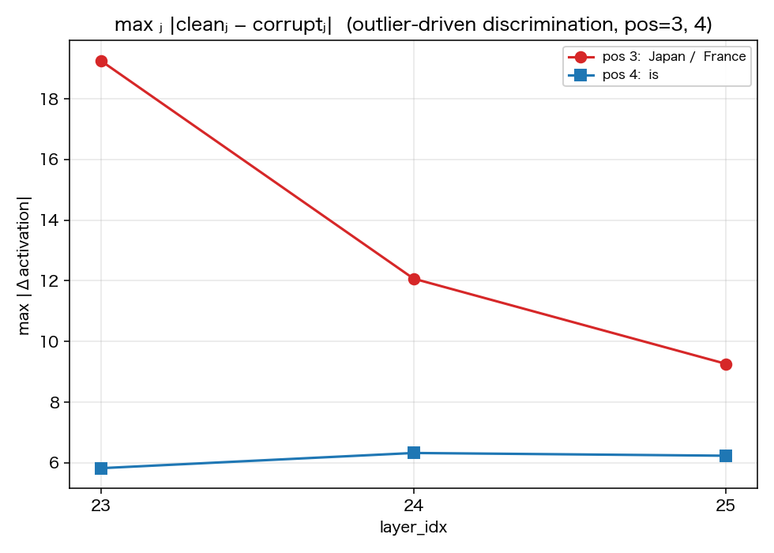
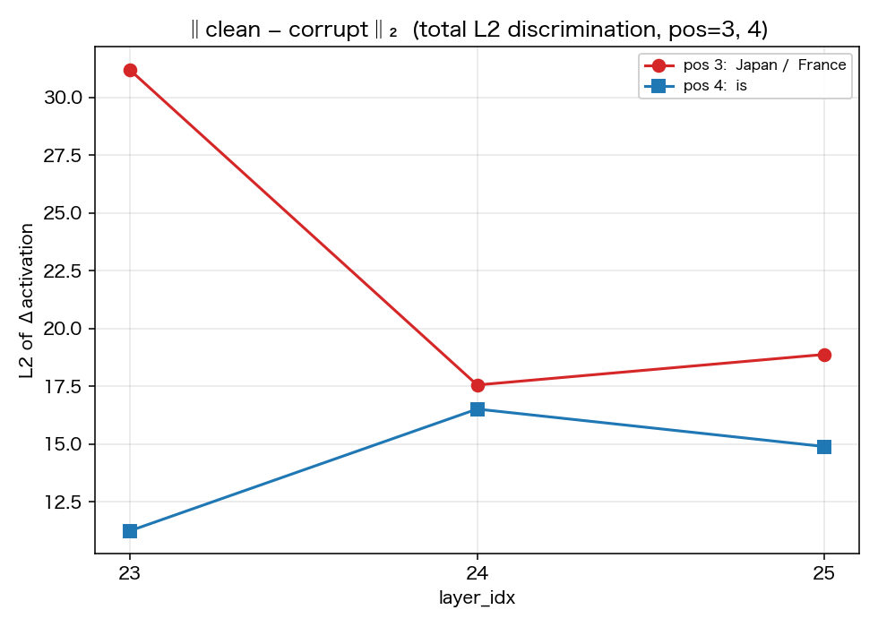
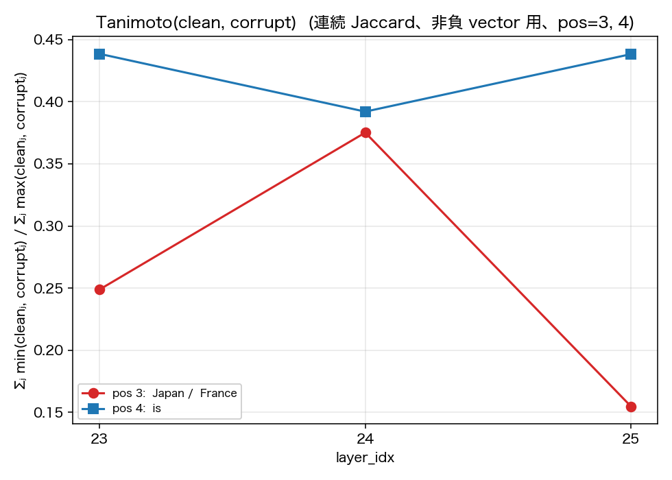
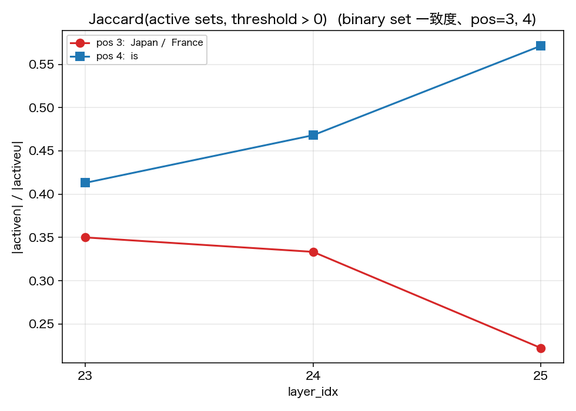
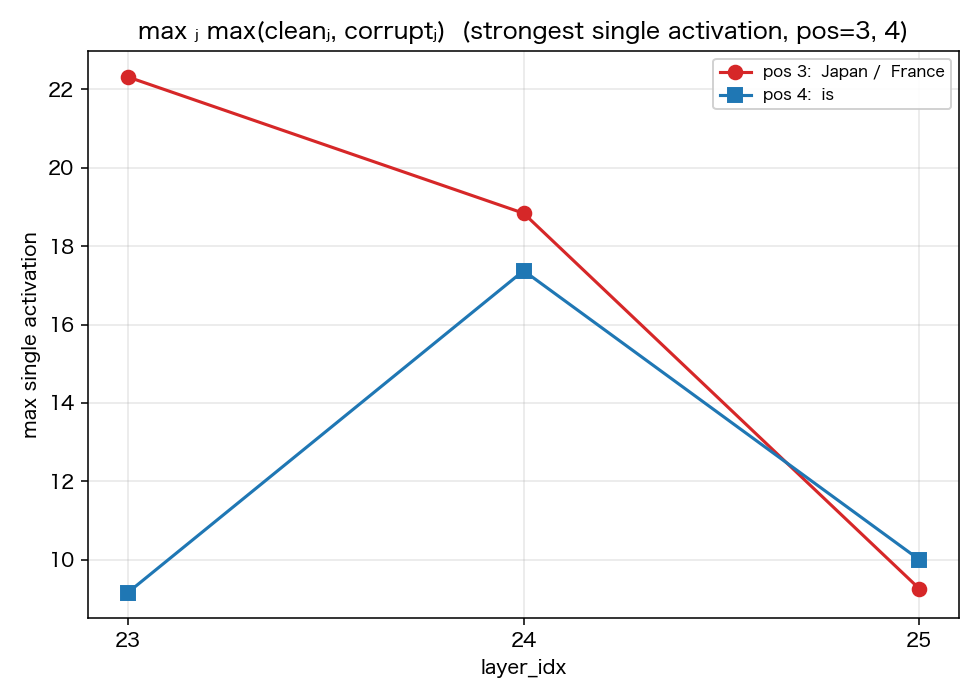
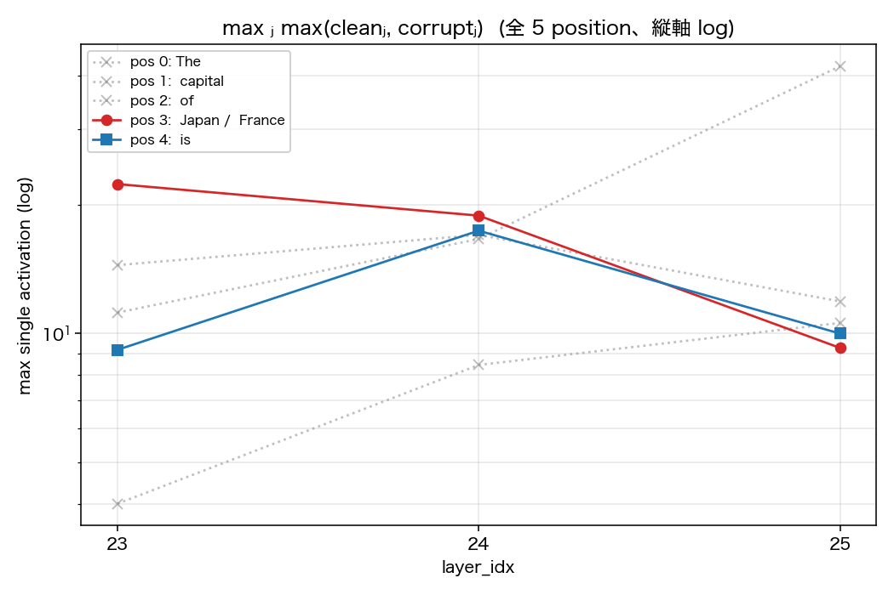
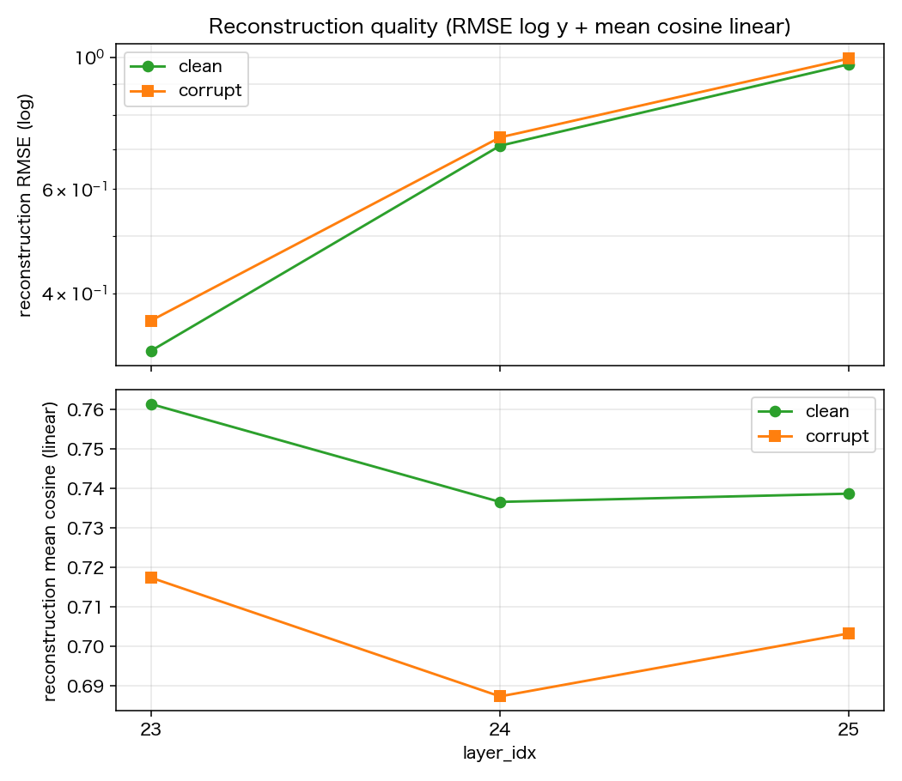

# Experiment 14: Qwen3-4B × mwhanna MLP transcoder — layers 23/24/25 詳細

Script: [`scripts/14_prelim_qwen3_4b_transcoder_smoke.py`](../scripts/14_prelim_qwen3_4b_transcoder_smoke.py)
最終更新: 2026-05-18
ステータス: ✅ 3 stage の更新を経て完成。layer 23/24/25 の per-layer 詳細解析を出力する。

---

## 1. 目的

- Hugging Face で公開されている community transcoder `mwhanna/qwen3-4b-transcoders` の使い勝手を確認する。
- **MLP transcoder** という新しい解析道具（後述）が、特定 layer の MLP が何を表現しているかを可視化できるかを試す。
- とくに note02 (residual stream patching) で着目した layer 24 付近で、clean prompt と corrupt prompt の MLP 内部状態の差がどう見えるかを確認する。

---

## 2. 背景: MLP transcoder とは何か

### 2-1. Transformer block の中の MLP の位置

Qwen3 を含む現代の Transformer の各 block（layer）は、おおざっぱに以下の構造です：

$$
\begin{aligned}
a_j &= h_j + \mathrm{Attn}(\mathrm{RMSNorm}_1(h_j)) \quad(\text{Attention sub-block}) \\
h_{j+1} &= a_j + \mathrm{MLP}(\mathrm{RMSNorm}_2(a_j)) \quad(\text{MLP sub-block})
\end{aligned}
$$

ここで $h_j \in \mathbb{R}^{T \times d_{\text{model}}}$ は **residual stream**（block $j$ の入力時点の表現、 $T$=トークン数、 $d_{\text{model}}$=hidden_size）。 $a_j$ は Attention sub-block 適用後・MLP 適用前の residual stream。block 内では Attention sub-block と MLP sub-block の 2 段で residual stream を更新します。なお $\mathrm{RMSNorm}_1, \mathrm{RMSNorm}_2$ は各 sub-block の入力正規化で、Qwen3 では平均減算を行う LayerNorm ではなくスケールのみの **RMSNorm** を使います。

この実験で対象にするのは **block $j$ の中の MLP** の挙動です。具体的には：

- **MLP input** $X_j$: post-attention の residual $a_j$ に RMSNorm（ $\mathrm{RMSNorm}_2$）をかけたもの。MLP module の forward に実際に渡される tensor。shape $[T, d_{\text{model}}]$。
- **MLP output** $Y_j$: MLP module が返す tensor（residual add 前）。shape $[T, d_{\text{model}}]$。

$$
Y_j = \mathrm{MLP}(X_j)
$$

### 2-2. MLP transcoder の定義（mwhanna 流儀）

通常の MLP は $X_j \mapsto Y_j$ を計算する非線形関数（Qwen3 では SwiGLU）。これを直接見ても解釈は難しい。

そこで **MLP transcoder** は、独立に学習された**サイドカー的 sparse autoencoder** で、以下のように $X_j$ → 中間 sparse feature → $Y_j$ という factorization を提供します：

$$
\begin{aligned}
\mathbf{f} &= \mathrm{ReLU}(X_j W_{\text{enc}}^\top + \mathbf{b}_{\text{enc}})
  \quad \in \mathbb{R}^{T \times d_{\text{feature}}}
  \quad \text{(encode)}\\[4pt]
\hat{Y}_j &= \mathbf{f} W_{\text{dec}} + \mathbf{b}_{\text{dec}}
  \quad \in \mathbb{R}^{T \times d_{\text{model}}}
  \quad \text{(decode)}
\end{aligned}
$$

学習は $\hat{Y}_j$ が真の MLP output $Y_j$ に近づくように、かつ $\mathbf{f}$ が sparse（多くの成分が 0）になるように行われます。

ここで:
- $d_{\text{feature}} = 163840 \gg d_{\text{model}} = 2560$。**overcomplete**（次元拡大）。
- ReLU により $\mathbf{f}$ は非負。
- ふつう各 token position で $d_{\text{feature}}$ のうち数十〜数百個しか正値にならない（**sparse**）。
- 各 $i \in \{0, 1, \dots, d_{\text{feature}}-1\}$ を **feature $i$** と呼ぶ。理論上、各 feature は「特定の意味概念」に対応しうる（解釈可能 features の仮説）。

### 2-3. ふつうの SAE との違い

| | 通常の residual-stream SAE | mwhanna の MLP transcoder |
|---|---|---|
| 入力 | residual stream $h_j$ | MLP input $X_j$ |
| 復元対象 | 入力自身 ($h_j \approx \hat{h}_j$) | MLP の **出力** ($Y_j \approx \hat{Y}_j$) |
| 役割 | residual stream の sparse 分解 | MLP の挙動の sparse approximation |

つまり mwhanna transcoder は「MLP 自体を、解釈可能 features の組み合わせとして近似する」ツール。residual stream のスナップショットを取るわけではない点に注意。

参考: MLP transcoder という考え方と標準的な定義については、Dunefsky, Chlenski & Nanda, *Transcoders Find Interpretable LLM Feature Circuits*, NeurIPS 2024 (arXiv:2406.11944) を参照。この論文では、transcoder を「元の MLP sublayer の入出力挙動を、より広く sparse に発火する MLP で近似するもの」として扱っている。本実験で用いる Qwen3-4B 用の学習済み重みは、Hugging Face の `mwhanna/qwen3-4b-transcoders`（Michael Hanna）から取得した配布 artifact である。

---

## 3. 実験設定

| 項目 | 値 |
|---|---|
| 対象モデル | `Qwen/Qwen3-4B` (K=36, hidden_size=2560) |
| 対象 transcoder | `mwhanna/qwen3-4b-transcoders` |
| 取得した layer | 23, 24, 25（各 1.68 GB の safetensors） |
| 取得方法 | `hf_hub_download` (snapshot_download は使わない) |
| device / dtype | mps / float16 (transcoder weights は CPU float32) |

### Prompt

```
clean   : "The capital of Japan is"   → 期待答え " Tokyo"
corrupt : "The capital of France is"  → 期待答え " Paris"
```

Tokenize すると両方とも 5 tokens。causal mask により最初の 3 tokens (`The capital of`) の hidden state は両 prompt で完全に同じになり、差は position 3 (` Japan` vs ` France`) 以降に現れます。

### Transcoder weights の形状（実測）

| key | shape | dtype |
|---|---|---|
| `W_enc` | `[163840, 2560]` | bfloat16 |
| `W_dec` | `[163840, 2560]` | bfloat16 |
| `b_enc` | `[163840]` | bfloat16 |
| `b_dec` | `[2560]` | bfloat16 |

→ $d_{\text{model}} = 2560$、 $d_{\text{feature}} = 163840$。
→ $W_{\text{enc}}$ の shape が `[d_feature, d_model]` なので、 $\mathbf{f} = \mathrm{ReLU}(X W_{\text{enc}}^\top + \mathbf{b}_{\text{enc}})$ という形になる（script 内では `features_x_in` orientation と呼んでいる）。

---

## 4. 方法: transcoder を使った feature 抽出

### 4-1. 全体のパイプライン

1. Qwen3-4B をロードし、`model.model.layers[i].mlp` に PyTorch hook を仕掛ける。
2. clean prompt と corrupt prompt を順番に forward する。
3. hook 経由で、各 layer の MLP input $X_j$ と MLP output $Y_j$ を CPU に取り出す（shape は両方 $[1, 5, 2560]$）。
4. 取り出した $X_j$ を transcoder encoder に通して feature activation $\mathbf{f} \in \mathbb{R}^{5 \times 163840}$ を計算する。
5. clean / corrupt の $\mathbf{f}$ を比較する（top-k、差分、再構成精度）。

### 4-2. PyTorch hook の中身（コード抜粋）

```python
target_mlp = model.model.layers[24].mlp  # 例: layer 24

# pre_hook: MLP module に入る直前の tensor を捕まえる
def pre_hook(module, inputs):
    mlp_in["clean"] = inputs[0].detach().cpu()  # X_j  [1, 5, 2560]

# post_hook: MLP module が返した tensor を捕まえる
def post_hook(module, inputs, output):
    mlp_out["clean"] = output.detach().cpu()    # Y_j  [1, 5, 2560]

handles = [
    target_mlp.register_forward_pre_hook(pre_hook),
    target_mlp.register_forward_hook(post_hook),
]
try:
    out = model(**clean_inputs, output_hidden_states=False, use_cache=False)
finally:
    for h in handles:
        h.remove()
```

このようにして $X_{24}^{\text{clean}}$, $X_{24}^{\text{corrupt}}$, $Y_{24}^{\text{clean}}$, $Y_{24}^{\text{corrupt}}$ をすべて取得する。

### 4-3. Encoder forward（コード ↔ 数式）

```python
X = mlp_in["clean"][0].to(torch.float32)   # shape [5, 2560]
pre = X @ W_enc.T + b_enc                  # shape [5, 163840]
features = torch.relu(pre)                 # shape [5, 163840]
```

これが上記の

$$
\mathbf{f} = \mathrm{ReLU}(X W_{\text{enc}}^\top + \mathbf{b}_{\text{enc}})
$$

そのもの。出力 `features` の $(t, i)$ 成分が「token position $t$ における feature $i$ の activation」。

### 4-4. Decoder forward（再構成チェック）

```python
recon = features @ W_dec + b_dec   # shape [5, 2560]
target = mlp_out["clean"][0].to(torch.float32)
diff = recon - target
rmse = (diff ** 2).mean().sqrt().item()
```

これは

$$
\hat{Y}_j = \mathbf{f} W_{\text{dec}} + \mathbf{b}_{\text{dec}}, \quad
\mathrm{RMSE} = \sqrt{\frac{1}{T \cdot d_{\text{model}}} \sum_{t,d} (\hat{Y}_{t,d} - Y_{t,d})^2}
$$

再構成 RMSE が小さいほど、transcoder が MLP の挙動をよく近似できていることを意味する。

---

## 5. 測定する指標の定義

結果テーブルを読むのに必要な指標を、コードと数式で明示しておきます。

| 指標 | 定義 | コード |
|---|---|---|
| **active_count / position** | 1 トークン position あたりに正値となる feature 数。 $\sum_i \mathbb{1}[f_{t,i} > 0]$ を $t$ について平均。 | `(feats > 0).sum(dim=-1).float().mean()` |
| **active_fraction (clean/corrupt)** | 全 $(t, i)$ ペアのうち $f_{t,i} > 0$ の割合。 $\frac{1}{T \cdot d_{\text{feature}}} \sum_{t,i} \mathbb{1}[f_{t,i} > 0]$ | `(feats > 0).float().mean()` |
| **top-k features at position $t$** | $f_{t,i}$ を $i$ について大きい順に並べて先頭 $k$ 個。 | `torch.topk(feats[t], k=20)` |
| **pos3 diff** | clean と corrupt の position 3 における feature 差分ベクトル $\boldsymbol\delta = \mathbf{f}^{\text{clean}}_3 - \mathbf{f}^{\text{corrupt}}_3 \in \mathbb{R}^{d_{\text{feature}}}$ | `clean_feats[3] - corrupt_feats[3]` |
| **pos3 max\|Δ\|** | $\max_i |\delta_i|$。pos=3 における clean vs corrupt の最大 feature 活性差。 | `diff.abs().max()` |
| **last diff / last max\|Δ\|** | 上記を最終 position (`pos=4`、ともに `' is'`) について計算したもの。 | 同上 |
| **reconstruction RMSE** | 上記 4-4 の式。clean run / corrupt run を別々に計算。 | `((recon - target)**2).mean().sqrt()` |
| **mean cosine** | 各 token position について $\cos(\hat{Y}_t, Y_t)$ を計算し、 $t$ について平均。方向の一致度。 | per-position cosine の `np.mean` |

### 「position」が何を意味するか（本実験での具体）

5 token prompt なので position は 0..4：

| position | clean token | corrupt token | 比較で見たいこと |
|---|---|---|---|
| 0 | `The` | `The` | 同一（causal mask、差なし） |
| 1 | `' capital'` | `' capital'` | 同一 |
| 2 | `' of'` | `' of'` | 同一 |
| **3** | **`' Japan'`** | **`' France'`** | **国名トークンの違いがどの feature に現れるか** |
| **4 (last)** | `' is'` | `' is'` | 同じトークンだが前文脈が違う。**文脈情報が ' is' position の feature 空間にどう残るか** |

→ `pos3 diff` は「Japan と France の語彙的識別 feature」を炙り出す。
→ `last diff` は「前文脈 (Japan / France) が ' is' の表現にどう持ち越されているか」を見る。

---

## 6. 結果

### 6-1. Sanity check（全 layer 共通）

最終 next-token 予測の top-1:

| run | top1 token | 期待 |
|---|---|---|
| clean   | `' Tokyo'` | `' Tokyo'` ✓ |
| corrupt | `' Paris'` | `' Paris'` ✓ |

→ モデルは正しく問題を解けている。差分解析が意味を持つ前提が成立。

### 6-2. Layer 間比較（3 layer 集約）

各列の意味:
- `active_frac (clean / corrupt)`: clean / corrupt 各 run の active_fraction。 $T \cdot d_{\text{feature}}$ 個のうち発火している割合。
- `pos=3 max|Δ|`: pos=3 (`' Japan'` vs `' France'`) における feature 差分の最大絶対値。大きいほど「ここで国名が違うことが feature 空間で目立つ」。
- `last max|Δ|`: last (`' is'` vs `' is'`、ただし前文脈が違う) における feature 差分の最大絶対値。大きいほど「同じトークンだが前文脈の違いが feature 空間に残っている」。
- `recon rmse (clean / corrupt)` / `recon mean_cos (clean / corrupt)`: 再構成精度。transcoder が MLP 出力をどれだけよく近似できているか。

| layer | active_frac (clean / corrupt) | pos=3 max\|Δ\| | last max\|Δ\| | recon rmse (clean / corrupt) | recon mean_cos (clean / corrupt) |
|---|---|---|---|---|---|
| 23 | 0.0006 / 0.0006 | **19.26** | 5.82 | 0.32 / 0.36 | 0.76 / 0.72 |
| 24 | 0.0034 / 0.0035 | 12.07 | 6.32 | 0.71 / 0.73 | 0.74 / 0.69 |
| 25 | 0.0086 / 0.0086 | 9.26 | **6.23** | 0.97 / 1.00 | 0.74 / 0.70 |

読み方:
- layer 23: 国名識別 (pos=3) の差が最大の 19.26、'is' position はまだ前文脈が伝播しきっていない (5.82)。
- layer 24: 国名識別の差が減少 (12.07)、代わりに 'is' position の差が増加 (6.32)。
- layer 25: 国名識別はさらに減少 (9.26)、'is' position はピーク維持 (6.23)。

→ 「pos=3 で立っていた国名識別 features の情報が、layer 24-25 で last position に流れている」物語が見える。

### 6-3. 各 layer の top1 feature（pos=3）

clean / corrupt それぞれの position 3 で **activation が最大の feature id**（rank 1）を見る。

| layer | clean `' Japan'` の top1 feature | corrupt `' France'` の top1 feature | コメント |
|---|---|---|---|
| 23 | f91721 (+22.31) | f91721 (+20.03) | **同じ feature が top1** ← Japan/France 両方で発火する汎用 feature が支配 |
| 24 | f30233 (+18.84) | f30233 (+15.89) | **同じ feature が top1** ← 別の汎用 feature が支配 |
| 25 | f15948 (+7.82)  | f95457 (+9.26)  | **初めて国名ごとに別 feature が top1** |

→ **L23, L24 では clean と corrupt で top1 feature が一致**する。f91721 や f30233 は「`The capital of X is` 構造の中で `X` 位置に固有の汎用 feature」と推測され、国名そのものではなく**文脈構造に対応**している。L25 で初めて国名固有 features (clean=f15948, corrupt=f95457) が top1 に到達。

→ つまり L23, L24 では国名固有の情報は top1 では見えず、**差分解析しないと炙り出せない**（section 6-4 への動機）。
→ L25 では国名情報が top1 まで上がってきており、出力層に近づくにつれて **token 識別が明示化される**過程が見える。

なお、`差分 top features`（clean − corrupt が大きい順、corrupt − clean が大きい順）は activation top1 とは別の量で、section 6-4 / 6-5 で扱う。差分 top features の代表値（参考）:

| layer | pos=3 clean>corrupt top | pos=3 corrupt>clean top |
|---|---|---|
| 23 | f80687 (+19.08) | f64429 (+19.26) |
| 24 | f132353 (+12.07) | f157818 (+6.19) |
| 25 | f76026 (+7.20)  | f95457 (+9.26) |

### 6-4. Layer 24 の差分解析 — pos=3 (Japan vs France)

定義: $\boldsymbol\delta = \mathbf{f}^{\text{clean}}_3 - \mathbf{f}^{\text{corrupt}}_3 \in \mathbb{R}^{163840}$ について、正側 top-5 (`Japan > France`) と負側 top-5 (`France > Japan`)。

```
Japan > France (clean で大きい features):
  f132353  +12.07  (clean=+12.07, corrupt=0.00)   ← Japan のみで発火
  f5788    +7.21   (clean=+16.75, corrupt=+9.54)
  f53280   +2.96
  f30233   +2.95   (文脈 top1 共通だが diff は小)
  f4714    +2.41
France > Japan (corrupt で大きい features):
  f157818  -6.19   (clean=0, corrupt=+6.19)       ← France のみで発火
  f100271  -4.45
  f74925   -2.77
  f10219   -1.95
  f81603   -1.82
```

→ 差分解析で初めて Japan/France 固有 features (f132353, f157818 など) が炙り出される。top1 (f30233) はスケール的に圧倒しているため、差分視点でないと国名固有 features は隠れる。

### 6-5. Layer 24 の差分解析 — last (' is' clean vs ' is' corrupt)

両 position とも token は `' is'` だが、前 4 token (`The capital of Japan` vs `The capital of France`) が違う。

```
clean ' is' > corrupt ' is':
  f89266   +6.32   (clean=+6.32, corrupt=0)
  f157364  +5.28
  f30233   +4.71   (共通 top1 だが clean 側で強い)
  f80022   +4.07
  f35447   +3.55
corrupt ' is' > clean ' is':
  f76363   -5.44   (clean=0, corrupt=+5.44)
  f50198   -3.45
  f80340   -3.11
  f78611   -2.86
  f112079  -2.54
```

→ **同じ token ' is' でも、前文脈 (Japan / France) で立つ features が違う**。文脈情報が ' is' position の MLP input にきちんと伝播していて、それを transcoder feature 空間で見える化できる。

---

## 7. 図

### Layer 24（note02 で着目した layer）

#### Layer 24 — Token × feature combined heatmap (sum & diff)


**Figure 1**: 上段 = sum (clean + corrupt activation, viridis)、下段 = diff (clean − corrupt, RdBu_r 発散カラーマップ)。両 heatmap で 5 token position × 60 features を表示、列順は両者で揃えてある（**全 163840 features の中から `max-over-10-cells` 降順で top-60 を選択**）。

- `pos 0..2`: causal mask により clean=corrupt → diff 行が完全に白
- `pos 3` (Japan / France): 国名の違いが diff に展開
- `pos 4` (' is' の前文脈差): 同じトークンだが clean/corrupt で異なる features が立つ
- sum 側で「**強く発火している features**」、diff 側で「**discriminative な features**」を 1 枚で対比できる

### Layer 23 — pos=3 max|Δ| ピーク layer


**Figure 2**: Layer 23 の sum & diff combined heatmap。Figure 1 と同じ layout。**pos=3 の diff が 3 layer 中で最大** (max|Δ|=19.26)、Japan/France の語彙識別ピーク。

### Layer 25 — last 立ち上がり完了後


**Figure 3**: Layer 25 の sum & diff combined heatmap。pos=3 max|Δ| は 9.26 まで減衰、代わりに pos=4 (' is') の diff が立ち上がり完了 (6.23)。

### 3-layer 集約: per-(layer, position) metrics（7 図）

各 (layer, position) の clean / corrupt feature vector $\mathbf{f}^{\text{clean}}_{\ell, p}, \mathbf{f}^{\text{corrupt}}_{\ell, p} \in \mathbb{R}^{163840}$ から計算したスカラ指標を、layer 軸 (x = [23, 24, 25]) でプロット。Figure 4-8 は **pos=3, 4 のみ**を 2 系列で表示（pos 0..2 は causal mask により差分系で 0、Tanimoto / Jaccard で 1.0 になり情報がないため省略）。Figure 9 は engagement の log spread を見る目的で全 5 position 表示。Figure 10 は layer-level の reconstruction quality（per-position ではない）。

以下、 $f^{\text{clean}}_j$ は $\mathbf{f}^{\text{clean}}_{\ell, p}$ の feature $j$ 成分（添字 $\ell, p$ 省略）。pos 3 = 赤 (Japan / France)、pos 4 = 青 (' is' の前文脈差)。

#### Figure 4 — outlier-driven discrimination (pos=3, 4)



$$
\text{max}_j \,\bigl|\,f^{\text{clean}}_j - f^{\text{corrupt}}_j\,\bigr|
$$

「最も大きな差分を生む 1 個の feature の値」。outlier-driven、シンプル。pos=3 (赤) は L23 で 19.26 ピーク → L24 12.07 → L25 9.26 と単調減少。pos=4 (青) は L24 でほぼピーク 6.32、L25 では 6.23。

#### Figure 5 — total L2 discrimination (pos=3, 4)



$$
\bigl\|\,\mathbf{f}^{\text{clean}} - \mathbf{f}^{\text{corrupt}}\,\bigr\|_2
\;=\; \sqrt{\sum_j \bigl(f^{\text{clean}}_j - f^{\text{corrupt}}_j\bigr)^2}
$$

全 features 込みの L2 ノルム。outlier 1 個ではなく「全 feature 込みの総合 discrimination」。pos=3 は L23 で 31.20、L24 で 17.56、L25 で 18.88（max\|Δ\| が L24→25 で単調減少だったのに対し L2 は L25 で微増）。pos=4 は L23 → L24 で 11.24 → 16.52 と増加、L25 で 14.89。

#### Figure 6 — Tanimoto similarity (連続 Jaccard, pos=3, 4)



$$
T\bigl(\mathbf{f}^{\text{clean}}, \mathbf{f}^{\text{corrupt}}\bigr)
\;=\; \frac{\sum_j \min\bigl(f^{\text{clean}}_j,\, f^{\text{corrupt}}_j\bigr)}{\sum_j \max\bigl(f^{\text{clean}}_j,\, f^{\text{corrupt}}_j\bigr)}
$$

**非負 vector に対する Jaccard の連続化**。binary vector $f_j \in \{0,1\}$ なら標準 Jaccard $|A \cap B| / |A \cup B|$ に一致。値そのものを使うので閾値不要。

mwhanna transcoder は **ReLU** で「pre-activation がわずかに正でも features が active 扱い」になる noise floor の問題を持つ（特に pos=0 で d_feature の 4% 弱が weakly-active）。素朴な閾値 0 の Jaccard では分母が膨らんで本来の overlap が薄まる。Tanimoto は min/max の magnitude weighting により、雑音 features（小さい値）の貢献を自然に減衰させる。cos と違って共起する強 features に過度に依存しない。

数値: pos=3 は L23 0.249 → L24 0.375 → L25 0.155（L24 局所ピーク → L25 急落）。pos=4 は L23 0.439 → L24 0.392 → L25 0.438（中庸で安定）。

#### Figure 7 — Jaccard similarity (binary, active sets, pos=3, 4)



$$
J\bigl(A^{\text{clean}}, A^{\text{corrupt}}\bigr)
\;=\; \frac{|A^{\text{clean}} \cap A^{\text{corrupt}}|}{|A^{\text{clean}} \cup A^{\text{corrupt}}|},
\quad A^{\text{clean}} = \{j : f^{\text{clean}}_j > 0\}
$$

magnitude を捨て、**発火 feature の set 一致度のみ**を測る binary 版。閾値 0 で ReLU の noise floor も拾う caveat あり。Tanimoto (Fig 6) と比較すると：

- pos=3 (赤): L23 0.350 → L24 0.333 → L25 0.222 と単調減少。Tanimoto と同じく L25 で低下するが、L24 で「Tanimoto は局所ピーク 0.375 / Jaccard は安定 0.333」とずれている。これは「L24 で重なる features の **数**は減らないが、それらの **強度**は両 prompt で揃ってきている」状態。
- pos=4 (青): L23 0.413 → L24 0.468 → L25 0.571 と単調増加。Tanimoto は中庸で動かないのに Jaccard は明確に上昇 → 「active 数の重なりは増えるが、magnitude は揃わない」状態（後段に向けて active set は収束、強度は依然差がある）。

→ **Tanimoto と Jaccard が同じ trend を示す（pos=3）と違う trend を示す（pos=4）の対比**が面白い。3 層だけだが「magnitude vs count どちらの観点で重なるか」が見える。

#### Figure 8 — engagement (strongest single activation, pos=3, 4)



$$
\text{max}_j \,\max\bigl(f^{\text{clean}}_j,\, f^{\text{corrupt}}_j\bigr)
$$

clean か corrupt の **どちらか強い方**で取った、最も強く発火する feature の値。「この position でこの layer の transcoder がどれだけ大きな単一 activation を出しているか」というエンゲージメント指標。discrimination ではない。pos=3: L23 22.31 → L24 18.84 → L25 9.26、pos=4: L23 9.16 → L24 17.37 → L25 10.00。

#### Figure 9 — max single activation 全 5 position 比較 (log y)



Figure 8 と同じ指標を **全 5 position + 縦軸 log スケール**で描画。pos 0..2 (グレー = causal mask、clean = corrupt) のスケール感も含めて見ると、各 position の engagement の絶対値関係が分かる。pos=0 'The' は前段 ' Japan' / ' France' より小さいが、後段では同程度（layer 数が 3 つだけなので大きな trend は見えないが、絶対値スケールの比較材料として）。

#### Figure 10 — reconstruction quality (RMSE log y + mean cosine linear)



上段 = RMSE（**log y**）、下段 = mean cosine（linear）。transcoder の reconstruction 品質チェック。layer 23 → 25 で RMSE は 0.320 → 0.710 → 0.974（log で見ると意味のある幅）、mean cosine は 0.761 → 0.737 → 0.739 でほぼ一定。後段 layer で MLP output 自体の magnitude が大きくなるため RMSE が増えるのは自然だが、cosine が安定していることから「方向は捉えられている」と判断できる。

---

**CSV**: [outputs/prelim_qwen3_4b_transcoder_layers23_24_25_position_metrics.csv](../outputs/prelim_qwen3_4b_transcoder_layers23_24_25_position_metrics.csv) (15 行 × 22 列、Tanimoto / Jaccard / max_single / 各種 L1/L2 norm / active count 内訳など)

---

## 8. 解釈

### 8-1. note02 の k=24→25 変化との対応

1. **pos=3 max|Δ| は layer 23 で最大 (19.3) → 24 (12.1) → 25 (9.3) と単調減少**
   - 解釈: Japan/France の語彙的識別 feature は早い層に強く、後段では文脈・出力寄りに変化していく。
   - note02 で k=24→25 の patching recovery が大きく変わったのは、語彙情報がここで「次に来るべき capital token の予測」に変換されるからだろう、という仮説を支持。

2. **last max|Δ| は layer 24 (6.32) と 25 (6.23) でほぼ同等、layer 23 (5.82) より大きい**
   - 「' is' の直後にどの capital を予測するか」の情報は layer 24-25 で立ち上がる。
   - これは note02 の logit-lens で k=24→25 にかけて答えトークン確率が立ち上がった現象と整合的。

3. **active_fraction が後段ほど顕著に上昇 (0.06% → 0.34% → 0.86%)**
   - 後段 MLP の方が多様な feature が発火する（より複雑な計算を行っている）。

### 8-2. top1 feature 30233 問題（layer 24）

- layer 24 では文脈 feature f30233 がトークン固有 features を top1 から押し出す。
- デモでは「top1 を除いた top-2..20」や「clean と corrupt の差分」を強調する方が、トークン固有 feature の存在を見せやすい。
- 例えば `' Japan'` と `' France'` の同 position で activation 差を取った feature ランキングを別途出すと、もっと意味のある絵になる。これは差分解析 (section 6-4) で実現済み。

### 8-3. 再構成精度

[Figure 10](#figure-10--reconstruction-quality-rmse-log-y--mean-cosine-linear) 参照。

- mean cosine 0.70-0.76 (clean / corrupt あわせて 0.69-0.76)、RMSE 0.32-1.00。完全一致しないが、orientation と bias は正しく組めている（cosine が安定している = 方向は捉えられている）。
- RMSE は layer 23 → 25 で 0.32 → 0.71 → 0.97 と単調増加。これは「後段で MLP output 自体の magnitude が大きくなる」ため自然な現象。一方 cosine は layer 間で 0.74 周辺で安定。
- 完全一致でない理由（推測）:
  - Qwen3 の MLP は SwiGLU、transcoder は単純 ReLU 圧縮
  - bfloat16 → float32 cast の影響
  - mwhanna の training objective が strict reconstruction ではない可能性

---

## 9. 応用への示唆

- **デモ映え**: layer 24 通常 heatmap で文脈 feature 30233 が共通に光り、差分 heatmap で Japan/France 固有 features が見える二段構成が描ける。
- **層方向 trend**: 3 layer の比較で「pos=3 (語彙識別) は layer 23 でピーク、その情報が layer 24-25 で last position に流れる」という流れが見える。
- **関連 notebook への寄与**: nb02 (residual stream patching) の k=24→25 transition と直接対応づけられる。nb03 では transcoder feature 視点で同じ transition を補強する素材として使える。
- **再利用したい figure**: layer 24 の combined sum+diff heatmap (Figure 1) と、3-layer 集約の指標群 (Figure 4-7: max\|Δ\|, ‖Δ‖₂, Tanimoto, Jaccard)。前者は単一 layer 内で「強い feature」と「discriminative feature」を 1 枚で対比、後者群は層方向の流れを **outlier / total L2 / 連続 set 類似度 / binary set 類似度** の 4 種で見せる。エンゲージメント指標 (Fig 8-9) と reconstruction 品質チェック (Fig 10) は補助的に。
- **注意点**: 公式 Qwen-Scope SAE ではなく community transcoder であること、residual SAE ではなく MLP transcoder であることを必ず明記する。

---

## 10. 開発の経緯（3 stage）

1. **Stage 1 (初版)**: layer 24 のみ、TopK CSV / heatmap / bar / reconstruction を出力。文脈 feature f30233 が top1 を支配する問題が判明。
2. **Stage 2 (差分解析追加)**: pos=3 と last の clean − corrupt 差分を計算し、bar/heatmap (diverging colormap) を追加。Japan/France 固有 features が炙り出されるようになった。
3. **Stage 3 (3-layer 拡張 + 集約指標群)**: LAYER_IDXS = [23, 24, 25] のループ化、per-(layer, position) metrics の CSV 保存と 7 種類の集約 line plot (max\|Δ\|, ‖Δ‖₂, Tanimoto, Jaccard, max single, max_single log all-pos, reconstruction) を追加。「pos=3 Δ は layer 23 ピーク、last Δ は layer 24-25 で立ち上がる」trend を観察。後段で magnitude vs set count の divergence は本実験 (3 layer) では明確には出ず、[docs/15](15_qwen3_4b_transcoder_layer_sweep.md) で全 36 layer 拡張時に明確化。

---

## 11. 出力ファイル

per-layer (× 3 layer):
- `outputs/prelim_qwen3_4b_transcoder_layer{23,24,25}_keys.json`
- `outputs/prelim_qwen3_4b_transcoder_layer{23,24,25}_top_features.csv`
- `outputs/prelim_qwen3_4b_transcoder_layer{23,24,25}_feature_matrix.csv`
- `outputs/prelim_qwen3_4b_transcoder_layer{23,24,25}_feature_diffs.csv`
- `outputs/prelim_qwen3_4b_transcoder_layer{23,24,25}_reconstruction_metrics.csv`
- `outputs/prelim_qwen3_4b_transcoder_layer{23,24,25}_summary.json`
- `outputs/nb03_qwen3_4b_transcoder_layer{23,24,25}_feature_heatmap.png`

aggregate:
- `outputs/prelim_qwen3_4b_transcoder_layers23_24_25_summary.csv`
- `outputs/prelim_qwen3_4b_transcoder_layers23_24_25_summary.json`
- `outputs/prelim_qwen3_4b_transcoder_layers23_24_25_position_metrics.csv` — 15 行 × 22 列
- `outputs/nb03_qwen3_4b_transcoder_layers23_24_25_max_abs_delta.png` — Fig 4 (pos=3, 4)
- `outputs/nb03_qwen3_4b_transcoder_layers23_24_25_l2_delta.png` — Fig 5 (pos=3, 4)
- `outputs/nb03_qwen3_4b_transcoder_layers23_24_25_tanimoto.png` — Fig 6 (pos=3, 4)
- `outputs/nb03_qwen3_4b_transcoder_layers23_24_25_jaccard.png` — Fig 7 (pos=3, 4)
- `outputs/nb03_qwen3_4b_transcoder_layers23_24_25_max_single.png` — Fig 8 (pos=3, 4)
- `outputs/nb03_qwen3_4b_transcoder_layers23_24_25_max_single_log.png` — Fig 9 (全 5 position、log y)
- `outputs/nb03_qwen3_4b_transcoder_layers23_24_25_reconstruction.png` — Fig 10 (RMSE log + cos linear)

---

## 12. 注意事項

- 巨大 weight (mwhanna は 1.68 GB / layer) は HF cache に置く。outputs/ には保存しない。
- 36 layer 全部を取得する場合は 56 GB 必要 → script 15 (sweep 版) で実施。
- transcoder weights は CPU float32 で扱う。MPS/CUDA に載せない（オーバーヘッドが大きいため）。
- **mwhanna の MLP transcoder は公式 Qwen-Scope SAE ではない**ことに注意。residual stream SAE （script 16/17 で扱う）と混同しない。
