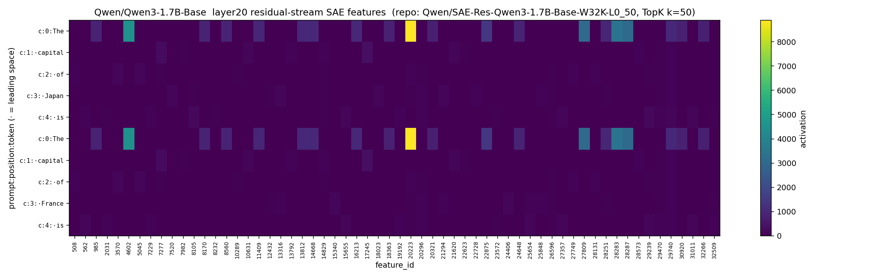
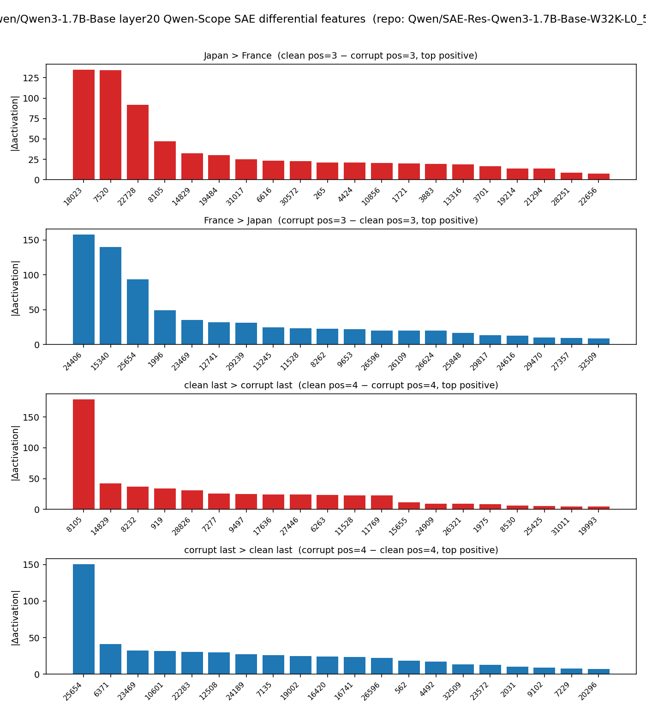
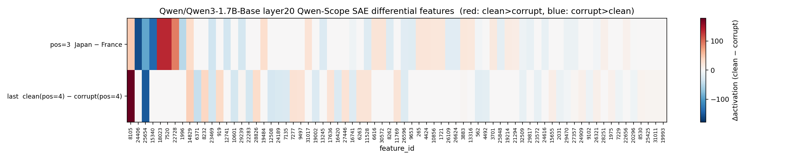

# Experiment 16: Qwen-Scope residual-stream SAE smoke (Qwen3-1.7B-Base layer 20)

Script: [`scripts/16_prelim_qwenscope_sae_smoke.py`](../scripts/16_prelim_qwenscope_sae_smoke.py)
最終更新: 2026-05-21
ステータス: ✅ smoke test 完了。1 layer (layer 20) の token × SAE feature activation と clean/corrupt 差分が描けることを確認。

---

> ## 重要 — 使用モデルは **Base** (Instruct ではない)、サイズは **1.7B** (4B ではない)
>
> 本実験は **`Qwen/Qwen3-1.7B-Base`** を対象にする。Instruct (= `Qwen/Qwen3-1.7B`) ではない。また workspace の他のスクリプト (script 04 系の forward probe, lecture/02 など) で使っている **Qwen3-4B でもない**。
>
> ### 1. なぜ Base なのか
>
> **Qwen-Scope SAE は基本的に Base モデルの residual stream を対象に学習されている**（Qwen3 系では 1.7B / 8B 等いずれも Base 学習で、Instruct backbone を使うのは Qwen3.5-27B のみという例外）。そのため本実験では Base モデルに適用するのが最も素直。Base SAE を Instruct / post-training checkpoint に当てると、SFT/RLHF で residual stream の分布が Base からシフトし、SAE encoder が out-of-distribution な入力を受けるため、再構成精度や feature 同定の信頼性が低下しうる。一方で Qwen-Scope 公式 model card は、Base モデルで学習した SAE を post-training checkpoint の内部過程探索に用いることも多くの場合 reasonable としている。本ノートでは解釈の安全性を優先して Base モデルに限定する。
>
> ### 2. なぜ 1.7B / 8B なのか (4B ではなく)
>
> **Qwen3-4B 用の Qwen-Scope SAE は Base 版も Instruct 版も公開されていない**。Hugging Face Hub 上で Qwen 公式が公開している `SAE-Res-Qwen3-*` checkpoint は以下のサイズに限られている (2026-05-21 時点):
>
> ```text
> Qwen3-1.7B-Base       W32K,         L0_50 / L0_100
> Qwen3-8B-Base         W64K,         L0_50 / L0_100
> Qwen3-30B-A3B-Base    W32K (L0_50) / W128K (L0_100)
> Qwen3.5-2B-Base       W32K,         L0_50 / L0_100
> Qwen3.5-9B-Base       W64K,         L0_50 / L0_100
> Qwen3.5-27B           W80K,         L0_50 / L0_100   (Base / Instruct の区別なし)
> Qwen3.5-35B-A3B-Base  W32K (L0_50) / W128K (L0_100)
> ```
>
> Qwen3 系で公式 SAE があるサイズは **1.7B / 8B / 30B-A3B のみ**で、0.6B / 4B / 14B / 32B は穴。
>
> 4B は完全に穴になっている。workspace では Qwen3-4B が主対象モデルだが、Qwen-Scope SAE 実験だけは「公式 SAE があるサイズ」に合わせて 1.7B / 8B を採用した。4B での同種実験は、script 14 (community MLP transcoder `mwhanna/qwen3-4b-transcoders`) で代替している (ただし residual SAE ではなく MLP transcoder で、入力も復元対象も違う)。
>
> ### 3. notebook 02 系との関係
>
> **workspace 内の `lecture/02_*` 系 (logit lens + residual stream patching) は Instruct (= `Qwen/Qwen3-4B` などの 4B / 1.7B / 8B Instruct) を使っているが、これは本 SAE 実験とモデルバリアントが違う**。SAE 実験 (script 16/17) と notebook 02 系は、それぞれの実験で利用可能な resource (公式 SAE が Base 専用 / logit lens は Instruct でも問題なし) に合わせて意図的に Base / Instruct を使い分けている。詳細な背景は §3 「Base 版を使う理由」を参照。

---

## 1. 目的

- Qwen 公式の **Qwen-Scope SAE**（residual stream sparse autoencoder, TopK 型）を、Hugging Face Transformers 既存 API + 軽い行列演算だけで動かせることを確認する。
- 軽い **`Qwen/Qwen3-1.7B-Base`** + `Qwen/SAE-Res-Qwen3-1.7B-Base-W32K-L0_50` で **smoke** を取り、1 layer (LAYER_IDX=20) の token × feature heatmap と clean / corrupt 差分が描けるかを見る。(モデル選択の制約は冒頭の重要事項参照)
- script 14 で扱った **community MLP transcoder** (`mwhanna/qwen3-4b-transcoders`) との対比を明確にし、以降の Qwen-Scope 実験 (script 17 = 8B 版) の土台にする。
- per-layer sweep は行わない。

---

## 2. 背景: Qwen-Scope SAE とは何か

### 2-1. Transformer block と residual stream

Qwen3 を含む現代 Transformer の各 block $j$ は、おおざっぱに以下の構造です（pre-LayerNorm Transformer）：

$$
h_{j+1} = h_j + \mathrm{Attn}(\mathrm{LN}_1(h_j)) + \mathrm{MLP}(\mathrm{LN}_2(h_j + \mathrm{Attn}(\cdots)))
$$

ここで $h_j \in \mathbb{R}^{T \times d_{\text{model}}}$ は **residual stream**（block $j$ の入力時点の表現）。Hugging Face Transformers の `output_hidden_states=True` で取れる `hidden_states` タプルは以下の対応:

```text
hidden_states[0]     = embedding output       (= pre layer 0 の residual stream)
hidden_states[j + 1] = block j の output      (= block j 通過後の residual stream)
hidden_states[K]     = final RMSNorm output   (lm_head 直前)
```

Qwen-Scope **residual stream SAE** は、特定 layer の **`hidden_states[j + 1]`**（= block $j$ の出力 residual stream）を入力として、それを sparse な feature 表現に分解・再構成するように学習されている。

### 2-2. SAE の定義（TopK 型）

通常の SAE は ReLU で sparse 化するが、Qwen-Scope SAE は **TopK** 型。各 token position $t$ ごとに、pre-activation の上位 $k$ 個だけを残し、残りを 0 にする：

$$
\begin{aligned}
\mathbf{p}_t &= h_{j+1,t} \, W_{\text{enc}}^\top + \mathbf{b}_{\text{enc}}
   \quad \in \mathbb{R}^{d_{\text{sae}}}
   \quad \text{(pre-activation, encoder)} \\[4pt]
\mathbf{f}_t &= \mathrm{TopK}_k(\mathbf{p}_t)
   \quad \in \mathbb{R}^{d_{\text{sae}}}
   \quad \text{(activation; non-top-k entries set to 0)} \\[4pt]
\hat{h}_{j+1,t} &= \mathbf{f}_t \, W_{\text{dec}} + \mathbf{b}_{\text{dec}}
   \quad \in \mathbb{R}^{d_{\text{model}}}
   \quad \text{(decode = reconstruct residual stream)}
\end{aligned}
$$

ここで:

- $d_{\text{sae}} = 32768$（W32K の意味）、 $d_{\text{model}} = 2048$（1.7B-Base の hidden_size）。 $d_{\text{sae}} \gg d_{\text{model}}$ で **overcomplete**。
- $k = 50$（L0_50 の意味、TopK の $k$）。 $\mathbf{f}_t$ は **正確に $k = 50$ 個**の非ゼロ成分を持つ。
- 本 script の encode は ReLU を掛けないため、pre-activation の符号がそのまま残り、上位 $k$ に負値が混じりうる（一般の TopK SAE は ReLU 併用で非負化することが多い; Gao et al. 2024）。
- 学習は $\hat{h}_{j+1} \approx h_{j+1}$（自己回帰的に residual stream を再構成）と $L_0 = k$ 制約のもとで行われる。

各 $i \in \{0, \dots, d_{\text{sae}} - 1\}$ を **feature $i$** と呼ぶ。

### 2-3. script 14 (MLP transcoder) との違い

| | community MLP transcoder (script 14) | Qwen-Scope residual-stream SAE (script 16/17) |
|---|---|---|
| 出処 | `mwhanna/qwen3-4b-transcoders` | `Qwen/SAE-Res-Qwen3-*-Base-*` (公式) |
| 入力 | MLP input $X_j$（post-attention の LN 出力） | residual stream $h_{j+1}$（block $j$ 出力） |
| 復元対象 | MLP の **出力** $Y_j$ | 入力自身 $h_{j+1}$（普通の SAE） |
| sparsity | ReLU + 学習で疎化 | **TopK $k=50$（正確に $k$ 本）** |
| 役割 | MLP 自体を sparse approximation | residual stream の sparse 分解 |

→ 16 は「**block $j$ 通過後の表現を、 $d_{\text{sae}} = 32768$ 次元の sparse 空間で見る**」道具。14 とは入力も復元対象も違う点に注意。

---

## 3. 実験設定

### Base 版を使う理由 (重要)

本実験では `Qwen/Qwen3-1.7B-Base` (Instruct ではなく Base) を使う。**理由は Qwen-Scope SAE が Base 専用に学習されているため**:

- Qwen 公式が公開している Qwen-Scope SAE checkpoint は `SAE-Res-Qwen3-*-Base-*` の形式で、命名どおり Base モデルの residual stream を学習対象にしている。Qwen3 系（1.7B / 8B など）には Instruct 用 SAE は (2026-05-21 時点で) 公開されていない（Qwen-Scope 全体では Qwen3.5-27B のみ Instruct backbone を学習対象とする例外がある）。
- Base SAE を Instruct モデルに当てると、Instruct の SFT/RLHF で residual stream の分布が Base からシフトするため、SAE encoder が out-of-distribution な入力を受け、再構成 RMSE 悪化や feature 同定精度の低下を招きうる。もっとも Qwen-Scope 公式 model card は Base SAE を post-training checkpoint に適用するのも多くの状況で合理的としており、本実験では分布ミスマッチを避けるため Base モデルに揃える。
- workspace 内の `lecture/02_qwen3_4b_residual_stream_logit_lens_patching.ipynb` および別途進行中の 1.7B/8B 派生 notebook 02 は **Instruct** を使っているが、これは logit lens / patching が SAE と違ってモデルバリアントに依存せず動くため。**本 SAE 実験 (script 16) と notebook 02 系はモデルバリアント (Base vs Instruct) が違う**ことに注意。

### 設定一覧

| 項目 | 値 |
|---|---|
| 対象モデル | `Qwen/Qwen3-1.7B-Base` (K=28, hidden_size=2048) |
| 対象 SAE | `Qwen/SAE-Res-Qwen3-1.7B-Base-W32K-L0_50` |
| LAYER_IDX | 20（→ 入力は `hidden_states[21]` = block 20 の出力） |
| TOP_K_SAE | 50 (L0_50 の $k$) |
| 取得方法 | `hf_hub_download` で `layer20.sae.pt` 単一ファイルのみ (snapshot_download は使わない) |
| SAE checkpoint size | 537 MB |
| device / dtype | mps / float16（SAE weights は CPU float32 で扱う） |

### Prompt

```text
clean   : "The capital of Japan is"   → 期待答え " Tokyo"
corrupt : "The capital of France is"  → 期待答え " Paris"
```

両方とも 5 tokens にトークナイズされる。causal mask により最初の 3 tokens (`The capital of`) の hidden state は両 prompt で完全に同じになり、差は position 3 (` Japan` vs ` France`) 以降に現れる。

### SAE checkpoint の形状（実測）

| key | shape | dtype |
|---|---|---|
| `W_enc` | `[32768, 2048]` | float32 |
| `W_dec` | `[2048, 32768]` | float32 |
| `b_enc` | `[32768]` | float32 |
| `b_dec` | `[2048]` | float32 |

→ $d_{\text{model}} = 2048$、 $d_{\text{sae}} = 32768$。 $W_{\text{enc}}$ の shape が `[d_sae, d_model]` なので、encode は $\mathbf{f} = \mathrm{TopK}(X W_{\text{enc}}^\top + \mathbf{b}_{\text{enc}})$ となる（script 内では `features_x_in` orientation と呼ぶ）。 $W_{\text{dec}}$ は `[d_model, d_sae]` なので decode は $\hat{X} = \mathbf{f} W_{\text{dec}}^\top + \mathbf{b}_{\text{dec}}$。

---

## 4. 方法: SAE encode / decode のパイプライン

### 4-1. 全体の流れ

1. SAE checkpoint を `hf_hub_download` で取得（HF cache に置く）。`torch.load(weights_only=True)` で state_dict を読み、`W_enc / W_dec / b_enc / b_dec` を defensive に拾う。
2. Qwen3-1.7B-Base を load し、clean / corrupt を順に `model(**inputs, output_hidden_states=True)` で forward。
3. `out.hidden_states[LAYER_IDX + 1]`（= `hidden_states[21]` = block 20 出力）を CPU の float32 で取り出す（shape `[5, 2048]`）。
4. **model を del + gc** して MPS cache を解放（SAE encode 計算のためのメモリを確保）。
5. SAE encode（TopK）で feature activation $\mathbf{f} \in \mathbb{R}^{5 \times 32768}$ を計算。
6. clean / corrupt の $\mathbf{f}$ を比較（per-position top-k、token × feature heatmap、pos=3 / last の差分、reconstruction）。

### 4-2. residual stream を取り出す（コード抜粋）

```python
with torch.no_grad():
    out = model(
        **inputs,
        output_hidden_states=True,
        output_attentions=False,
        use_cache=False,
    )
residual = out.hidden_states[LAYER_IDX + 1][0].detach().float().cpu()
# residual: [seq_len=5, d_model=2048]   = block 20 の出力
```

`hidden_states[LAYER_IDX + 1]` で「block $\text{LAYER\_IDX}$ 通過後の residual stream」が取れる。これがそのまま SAE への入力になる。

### 4-3. TopK encode（コード ↔ 数式）

```python
def encode_topk(X: torch.Tensor):
    pre = X @ W_enc.T + b_enc                    # [5, 32768]   pre-activation
    vals, idx = torch.topk(pre, k=TOP_K_SAE, dim=-1)
    feats = torch.zeros_like(pre)
    feats.scatter_(dim=-1, index=idx, src=vals)  # 上位 k 以外を 0
    return pre, feats
```

これがそのまま

$$
\mathbf{p} = X W_{\text{enc}}^\top + \mathbf{b}_{\text{enc}}, \qquad
\mathbf{f} = \mathrm{TopK}_{k}(\mathbf{p})
$$

の実装。出力 `feats` の $(t, i)$ 成分が「token position $t$ における feature $i$ の activation」。正確に $k = 50$ 個だけ非ゼロ（負値も含む）。

### 4-4. Decode（再構成チェック）

```python
recon = feats @ W_dec.T + b_dec          # [5, 2048]
target = residual                         # [5, 2048]
diff = recon - target
rmse = (diff ** 2).mean().sqrt().item()
```

これは $\hat{X} = \mathbf{f} W_{\text{dec}}^\top + \mathbf{b}_{\text{dec}}$、RMSE は

$$
\mathrm{RMSE} = \sqrt{\frac{1}{T \cdot d_{\text{model}}} \sum_{t,d} (\hat{X}_{t,d} - X_{t,d})^2}
$$

加えて per-position cosine $\cos(\hat{X}_t, X_t)$ を計算し、 $t$ について平均する。

---

## 5. 測定する指標の定義

| 指標 | 定義 | コード |
|---|---|---|
| **active_count / position** | 1 トークン position あたりに非ゼロな feature 数。TopK では理論上 $k = 50$。 | `(feats != 0).sum(dim=-1).float().mean()` |
| **active_fraction** | 全 $(t, i)$ ペアのうち非ゼロな割合。理論上 $k / d_{\text{sae}} = 50/32768 \approx 0.00153$。 | `(feats != 0).float().mean()` |
| **top-k features at position $t$** | $f_{t,i}$ を $i$ について大きい順に並べた先頭 $k$ 個。 | `torch.topk(feats[t], k=20)` |
| **pos3 diff** | clean と corrupt の position 3 における feature 差分ベクトル $\boldsymbol\delta = \mathbf{f}^{\text{clean}}_3 - \mathbf{f}^{\text{corrupt}}_3 \in \mathbb{R}^{d_{\text{sae}}}$ | `clean_feats[3] - corrupt_feats[3]` |
| **pos3 max\|Δ\|** | $\max_i \|\delta_i\|$。pos=3 における clean vs corrupt の最大 feature 活性差。 | `diff.abs().max()` |
| **last diff / last max\|Δ\|** | 上記を最終 position (`pos=4`、ともに `' is'`) について計算したもの。 | 同上 |
| **reconstruction RMSE** | 上記 4-4 の式。clean / corrupt 別々に計算。 | `((recon - target)**2).mean().sqrt()` |
| **mean cosine** | per-position cosine $\cos(\hat{X}_t, X_t)$ を $t$ で平均。 | `np.mean(cos_vals)` |

### 「position」が何を意味するか（本実験での具体）

5 token prompt なので position は 0..4。

| position | clean token | corrupt token | 比較で見たいこと |
|---|---|---|---|
| 0 | `The`       | `The`       | 同一（causal mask、差なし） |
| 1 | `' capital'` | `' capital'` | 同一 |
| 2 | `' of'`     | `' of'`     | 同一 |
| **3** | **`' Japan'`** | **`' France'`** | **国名トークンの違いがどの feature に現れるか** |
| **4 (last)** | `' is'` | `' is'` | 同じトークンだが前文脈が違う。**前文脈情報が ' is' の feature 空間にどう残るか** |

---

## 6. 結果

### 6-1. Sanity check

最終 next-token の top-1:

| run | top1 token | 期待 |
|---|---|---|
| clean   | `' Tokyo'` | `' Tokyo'` ✓ |
| corrupt | `' Paris'` | `' Paris'` ✓ |

→ モデルが正しく問題を解けている。差分解析が意味を持つ前提が成立。

### 6-2. SAE encode 統計（実測）

理論値 active_fraction = $50 / 32768 \approx 0.001526$、active_count = 50。実測も両 prompt で完全に一致（TopK の定義どおり）。

### 6-3. Per-position top1 feature

各列の意味:
- `top1 feature_id`: その position で activation が最大の feature id
- `activation`: その activation 値

| prompt | pos | token | top1 feature_id | activation |
|---|---|---|---|---|
| clean   | 3 | `' Japan'`  | **f18023** | +134.89 |
| corrupt | 3 | `' France'` | **f24406** | +157.73 |
| clean   | 4 | `' is'`     | **f8105**  | +178.51 |
| corrupt | 4 | `' is'`     | **f29239** | +172.44 |

→ **pos=3 で clean / corrupt の top1 feature が完全に別**: f18023 (Japan) vs f24406 (France)。これは script 14 (4B MLP transcoder) の layer 24 で「文脈 feature f30233 が両方で top1」となっていた状況と対照的で、Qwen-Scope SAE では layer 20 の段階で**トークン固有 feature が top1 になる**ことを意味する。

→ **pos=4 ('is') でも top1 が別**: clean=f8105, corrupt=f29239。同じ token `' is'` だが、前文脈 (Japan / France) の違いが top1 レベルで現れている。

### 6-4. 差分解析 — pos=3 (Japan vs France)

定義: $\boldsymbol\delta = \mathbf{f}^{\text{clean}}_3 - \mathbf{f}^{\text{corrupt}}_3$ について正側 top（clean > corrupt）と負側 top（corrupt > clean）。

| 方向 | feature_id | clean | corrupt | Δ |
|---|---:|---:|---:|---:|
| Japan > France | f18023  | +134.89 |   0.00 | **+134.89** |
| Japan > France | f7520   | +134.33 |   0.00 | +134.33 |
| Japan > France | f22728  |  +91.99 |   0.00 |  +91.99 |
| Japan > France | f8105   |  +47.02 |   0.00 |  +47.02 |
| Japan > France | f14829  |  +58.01 | +25.42 |  +32.59 |
| France > Japan | f24406  |   0.00 | +157.73 | **−157.73** |
| France > Japan | f15340  |   0.00 | +139.88 | −139.88 |
| France > Japan | f25654  |   0.00 |  +93.24 |  −93.24 |
| France > Japan | f1996   |   0.00 |  +49.08 |  −49.08 |

`pos3 max|Δ|` = **157.73**（f24406, corrupt のみ発火）。Top features の大半は片側で 0、もう片側で 100 以上というクリーンな分離パターンで、TopK SAE が trans coder より sharper な discrimination を出している。

注: pos=4 の top1 f8105 は pos=3 の clean diff top でも上位 (+47.02) に現れる。「Japan で立った feature が次の `' is'` position で別の文脈使い方をされて再び top1 化」している可能性があるが、本 smoke では深追いしない。

### 6-5. 差分解析 — last (' is' clean vs ' is' corrupt)

同じ token `' is'` だが前文脈 (`The capital of Japan` vs `The capital of France`) が違う。top1 が違うこと (f8105 vs f29239) は上述。**`last max|Δ|` は CSV [`prelim_qwenscope_sae_layer20_feature_diffs.csv`](../outputs/prelim_qwenscope_sae_layer20_feature_diffs.csv) の `last_clean_minus_corrupt` を参照**（最終位置でも clean/corrupt の表現が feature 空間で大きく分離している）。

### 6-6. Reconstruction

| prompt | RMSE | mean cosine |
|---|---:|---:|
| clean   | 63.57 | 0.941 |
| corrupt | 63.58 | 0.939 |

絶対値の RMSE は大きいが、これは residual stream の norm が大きいことに起因（residual stream は層が深くなるほど accumulation でノルムが大きくなる）。**方向としては cos ≈ 0.94 で揃っており**、SAE が residual stream を一定の精度で再構成できていることを示す。完全一致しないのは、`k = 50` という強い sparsity 制約 + Qwen-Scope の学習データ分布 (おそらく自然文) と本 prompt の cap-of-X 構造のミスマッチ、と推測される。

---

## 7. 図

### Figure 1 — Token × feature heatmap



**Figure 1**: 縦軸 = `prompt:position:token`（clean: c0-c4、corrupt: k0-k4、· は leading space）、横軸 = 全 $d_{\text{sae}}$ = 32768 features から「いずれかの prompt × position で top-20 入りした features の union」(73 → 60 個を `max activation 降順`で選定)、colormap = viridis（activation）。

- `pos 0..2`（causal mask）: clean と corrupt の行が完全に同じパターンになる。
- `pos 3` (`' Japan'` / `' France'`): 縦に走る色帯が clean/corrupt で全く別の列に立つ → トークン固有 features が top1 を取っている。
- `pos 4` (`' is'`): 同じ token なのに、clean と corrupt で立つ features が完全に別。前文脈情報が feature 空間に残っている。

### Figure 2 — Differential bar plot (top features)



**Figure 2**: 4 段の bar plot。上 2 段 = pos=3 (Japan / France)、下 2 段 = last pos (' is' / ' is')。各段 = $|\Delta\text{activation}|$ の top-20 features。赤 = clean > corrupt（Japan-side / clean-last-side）、青 = corrupt > clean（France-side / corrupt-last-side）。

→ pos=3 では clean 側 (Japan) 4 features (f18023, f7520, f22728, f8105) と corrupt 側 (France) 4 features (f24406, f15340, f25654, f1996) がほぼ 0 vs 100+ で対立しており、**TopK SAE のクリーンな分離**が見える。

### Figure 3 — Differential heatmap (pos=3 vs last)



**Figure 3**: 2 行 (pos=3 / last) × 73 列 (両 comparison の top-k features の union、`max-over-rows |Δ|` 降順)。発散カラーマップ RdBu_r（赤=clean>corrupt、青=corrupt>clean）。

→ pos=3 と last position で **discriminative features の集合が全く異なる**ことが一目でわかる。pos=3 の features は last 行ではほぼ白（ある程度の feature 移動はある）、last の features は pos=3 行でほぼ白。

---

## 8. 解釈

- **TopK SAE は ReLU SAE よりトークン固有 feature が top1 に出やすい**: script 14 (mwhanna 4B transcoder, ReLU) では layer 24 の top1 が「文脈共通 feature f30233」だったが、本 1.7B Qwen-Scope SAE (TopK, k=50) では layer 20 の top1 が「国名固有 feature」(f18023 / f24406) で完全に分離している。TopK の $k$ を制限していることで、文脈共通 features が大量に発火して discriminative features を希釈する現象が抑えられている、と解釈できる。
- **layer index 20（0始まり、28 block 中 20/28 ≈ 71%、対応する hidden_states は hs[21]）で既にトークン分離が見える**: 中盤後半の residual stream が、すでにトークン固有の feature 空間で「整理されている」状況。この layer がモデル全体の logit lens / patching の中でどこに位置するかは、別途進行中の 1.7B 用 notebook 02 で確認する予定。
- **last position (' is') にも前文脈の差が残る**: causal LM の self-attention が、`' is'` トークンに対しても直前の `' Japan'` / `' France'` の情報を持ち越している証拠が、feature 空間で見える。

---

## 9. 応用への示唆

- **デモ映え**: heatmap 1 枚で「causal mask による pos 0..2 の完全一致」「pos=3 でのトークン固有 feature 出現」「pos=4 (' is') でも前文脈差が残る」の 3 点をひとめで見せられる。
- **8B 版への自然な拡張**: 同じパイプラインを `Qwen/Qwen3-8B-Base` + `SAE-Res-Qwen3-8B-Base-W64K-L0_50` (layer 24) に適用したのが [docs/17](17_qwenscope_sae_qwen3_8b_layer24.md)。
- **logit lens / patching との位置合わせ**: SAE layer_idx = j は `hidden_states[j + 1]` を読むため、patching/logit-lens の k = j + 1 と対応する。各モデルでこの k 位置が recovery 曲線上のどこに当たるかは、別途進行中の 1.7B / 8B 用 notebook 02 (lecture/02_qwen3_*_base_residual_stream_logit_lens_patching.ipynb) で確認する想定。
- **再利用したい figure**: Figure 1 (token × feature heatmap) をアイキャッチに使うと「Sparse Autoencoder で residual stream を見るとはこういうこと」が 1 図で伝わる。

---

## 10. 出力ファイル

```text
outputs/prelim_qwenscope_sae_layer20_keys.json
outputs/prelim_qwenscope_sae_layer20_top_features.csv
outputs/prelim_qwenscope_sae_layer20_feature_matrix.csv
outputs/prelim_qwenscope_sae_layer20_feature_diffs.csv
outputs/prelim_qwenscope_sae_layer20_reconstruction_metrics.csv
outputs/prelim_qwenscope_sae_layer20_summary.json
outputs/nb03_qwenscope_sae_layer20_feature_heatmap.png
outputs/nb03_qwenscope_sae_layer20_feature_diffs_bar.png
outputs/nb03_qwenscope_sae_layer20_feature_diffs_heatmap.png
```

---

## 11. 注意事項

- **公式 Qwen-Scope SAE は residual stream SAE** であり、script 14 の community MLP transcoder (`mwhanna/qwen3-4b-transcoders`) とは入力も復元対象も sparsity 機構も違う。混同しない。
- SAE checkpoint は **1.7B 版で 537 MB**。Hugging Face cache に置く。`outputs/` に保存しない。
- `hf_hub_download` で **単一ファイルだけ** 取得する。`snapshot_download` を使うと repo 全体を引きに行くので避ける（per-layer SAE が多数あるため）。
- SAE 重みは **CPU float32** で扱う。MPS/CUDA への載せ替えは行わない（モデル forward 後に CPU で encode するため）。
- TopK SAE は `k = 50` が固定なので、active_fraction や active_count の調整余地はない。代わりに W32K / W64K (SAE 幅) や L0_50 / L0_20 などのバリエーションが Qwen 公式から複数公開されている。

---

## 12. 関連実験

- [docs/14](14_qwen3_4b_transcoder_layers23_24_25.md): community MLP transcoder (4B, layers 23-25)。本 16 とは入力も復元対象も違う。top1 が「文脈共通 feature」になる現象が出る。
- [docs/17](17_qwenscope_sae_qwen3_8b_layer24.md): 同じ Qwen-Scope SAE を `Qwen3-8B-Base` + `SAE-Res-Qwen3-8B-Base-W64K-L0_50` (layer 24) で実行した 8B 版。
- 別途進行中の 1.7B / 8B 用 notebook 02 (= lecture/02_qwen3_4b_residual_stream_logit_lens_patching.ipynb の 1.7B / 8B 派生): logit lens + residual stream patching。**こちらは Instruct を使用**。本 SAE 実験 (Base) とはモデルバリアントが違うため、本 SAE layer 20 の正確な位置確認には Base 版の 1.7B notebook を別途用意するか、Instruct 版での結果を参考値として扱う必要がある。
