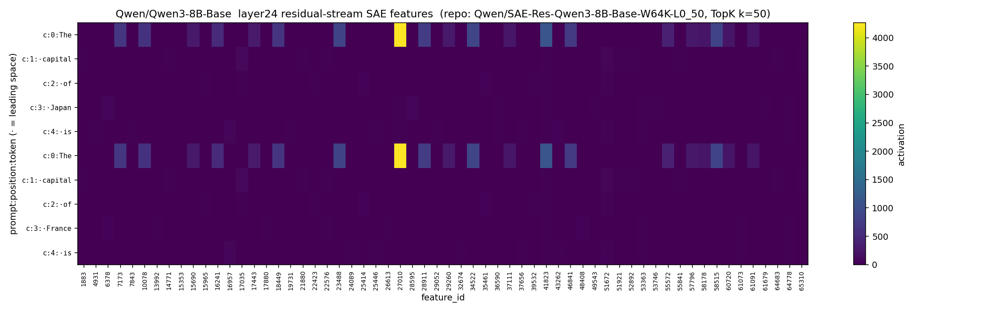
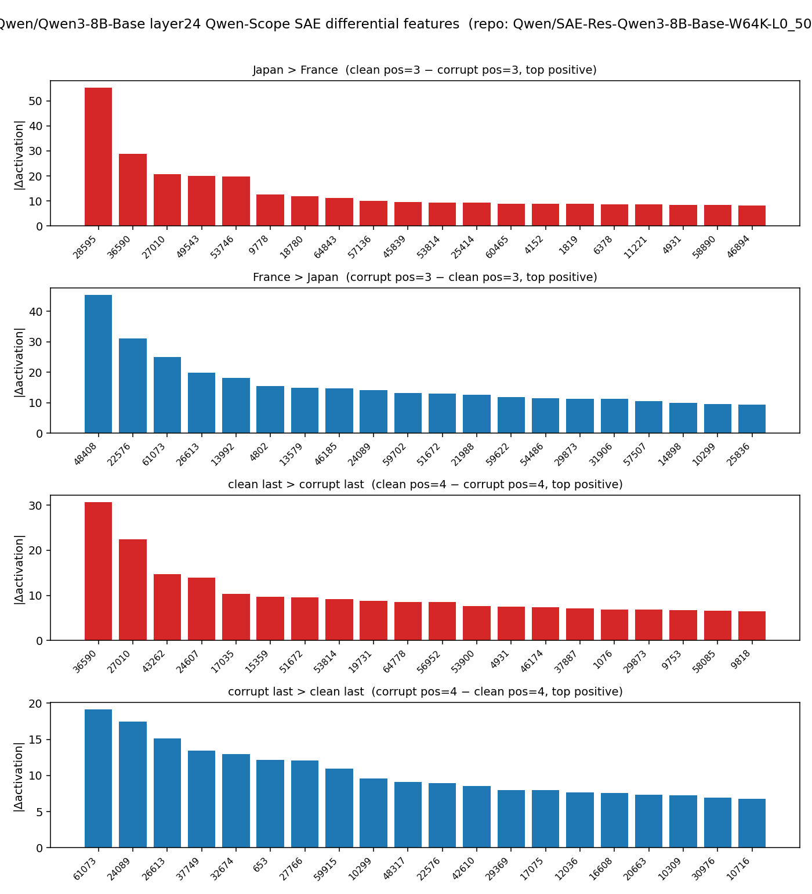
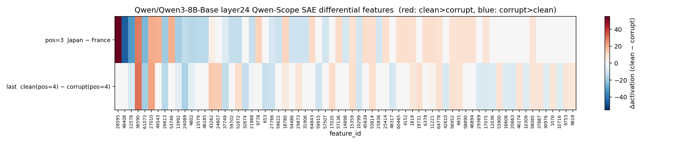

# Experiment 17: Qwen-Scope residual-stream SAE smoke (Qwen3-8B-Base layer 24)

Script: [`scripts/17_prelim_qwenscope_sae_8b_smoke.py`](../scripts/17_prelim_qwenscope_sae_8b_smoke.py)
最終更新: 2026-05-21
ステータス: ✅ smoke test 完了。1.7B 版 (docs/16) と同じパイプラインを 8B モデルで実行できることを確認。

---

> ## 重要 — 使用モデルは **Base** (Instruct ではない)
>
> 本実験は **`Qwen/Qwen3-8B-Base`** を対象にする。Instruct (= `Qwen/Qwen3-8B`) ではない。
>
> 理由: **Qwen-Scope SAE は基本的に Base モデルの residual stream を対象に学習されている**。Qwen3-8B（および Qwen3 系の他サイズ）には Instruct 用 SAE は (2026-05-21 時点で) 公開されていない（Qwen-Scope で Instruct backbone を学習するのは Qwen3.5-27B のみ）。Base SAE を Instruct / post-training checkpoint に当てると分布シフトで out-of-distribution になり、再構成精度や feature 同定の信頼性が低下しうる。一方で Qwen-Scope 公式 model card は、Base モデルで学習した SAE を post-training checkpoint の内部過程探索に用いることも多くの場合 reasonable としている。本ノートでは解釈の安全性を優先して Base モデルに限定する。
>
> **workspace 内の `notebooks/02_*` 系 (logit lens + residual stream patching) は Instruct を使っているが、これは本 SAE 実験とモデルバリアントが違う**。詳細な背景は [docs/16 の §3 「Base 版を使う理由」](16_qwenscope_sae_qwen3_1p7b_layer20.md#3-実験設定) を参照。

---

## 1. 概要

[docs/16](16_qwenscope_sae_qwen3_1p7b_layer20.md) の 8B 版。**両 doc とも Base を使う** (上記の重要事項を参照)。

| 項目 | docs/16 (1.7B) | 本実験 (8B) |
|---|---|---|
| 対象モデル | **`Qwen/Qwen3-1.7B-Base`** (K=28, hidden=2048) | **`Qwen/Qwen3-8B-Base`** (K=36, hidden=4096) |
| 対象 SAE | `SAE-Res-Qwen3-1.7B-Base-W32K-L0_50` | `SAE-Res-Qwen3-8B-Base-W64K-L0_50` |
| LAYER_IDX | 20 (→ hs[21], 20/28 ≈ 71% 深さ) | 24 (→ hs[25], 24/36 ≈ 67% 深さ) |
| $d_{\text{sae}}$ | 32768 | **65536** |
| TopK $k$ | 50 | 50 |
| SAE checkpoint size | 537 MB | **2.15 GB** |

手法・指標の数式定義は **[docs/16 の §2-§5](16_qwenscope_sae_qwen3_1p7b_layer20.md#2-背景-qwen-scope-sae-とは何か) を参照**。本 doc では 8B 固有の差分のみを記録する。

---

## 2. 目的

- 16 と同じパイプラインが、より大きい 8B-Base + W64K (= $d_{\text{sae}} = 65536$) でも動くことを確認する。
- 8B モデルは MPS で 16GB 級のメモリ圧迫があるので、**model forward 後に model を del → SAE 重みを load** という処理順序が必要であることを実装で確認する。
- LAYER_IDX=24 は Qwen-Scope 公式が「Qwen3-8B の中盤」として公開している layer。patching/lens 曲線上の位置確認は別途進行中の 8B 用 notebook 02 で行う想定。

---

## 3. 1.7B 版との実装差分

### 3-1. メモリ節約のための処理順序

8B モデル (約 16 GB / float16) と W64K SAE 重み (2.15 GB) を同時に保持するのは MPS の 64 GB unified memory でも厳しいので、以下の順序にしてある:

```text
1. SAE checkpoint は hf_hub_download で path だけ確保（まだ load しない）
2. tokenizer load
3. 8B model load → device に乗せる → clean / corrupt forward → residual を CPU へ
4. model を del + gc + torch.mps.empty_cache()
5. その後で SAE checkpoint を torch.load → encode / decode
```

1.7B 版 (16) では model と SAE を順に load しても問題ないが、8B 版 (17) ではこの順序が必須。

### 3-2. SAE checkpoint の形状（実測）

| key | shape | dtype |
|---|---|---|
| `W_enc` | `[65536, 4096]` | float32 |
| `W_dec` | `[4096, 65536]` | float32 |
| `b_enc` | `[65536]` | float32 |
| `b_dec` | `[4096]` | float32 |

→ $d_{\text{model}} = 4096$, $d_{\text{sae}} = 65536$。1.7B 版から $d_{\text{model}}$ は 2 倍、$d_{\text{sae}}$ は 2 倍、SAE 全体のパラメータ数は約 4 倍。

その他のコード（encode/decode/diff/heatmap/reconstruction）は 16 とほぼ同一で、ファイル名 prefix が `prelim_qwenscope_sae_qwen3_8b_layer24_*` / `nb03_qwenscope_sae_qwen3_8b_layer24_*` に変わるだけ。

---

## 4. 結果

### 4-1. Sanity check

| run | top1 token | 期待 |
|---|---|---|
| clean   | `' Tokyo'` | `' Tokyo'` ✓ |
| corrupt | `' Paris'` | `' Paris'` ✓ |

### 4-2. Per-position top1 feature

| prompt | pos | token | top1 feature_id | activation |
|---|---|---|---|---|
| clean   | 3 | `' Japan'`  | **f6378**  | +58.27 |
| corrupt | 3 | `' France'` | **f6378**  | +49.58 |
| clean   | 4 | `' is'`     | **f16957** | +51.61 |
| corrupt | 4 | `' is'`     | **f16957** | +51.71 |

→ **8B では pos=3 / pos=4 とも clean と corrupt で同じ feature が top1**。1.7B 版 (16) は pos=3, pos=4 とも完全に別 feature が top1 だったのと対照的で、**script 14 の 4B MLP transcoder layer 24 で見えた「文脈共通 feature top1」現象に類似**している。

→ f6378 は両 prompt の pos=3 で発火しているので「`The capital of X is` 構文の X 位置に立つ汎用 feature」と推測される。f16957 は pos=4 (' is') で立つので「' is' の前文脈情報を整理する feature」と推測。実際の意味は features-explanations データで照合しないと確定しないが、smoke の範囲では「層が深いほど共通の文脈 features が大きく出る」傾向と見做せる。

### 4-3. 差分解析 — pos=3 (Japan vs France)

| 方向 | feature_id | clean | corrupt | Δ |
|---|---:|---:|---:|---:|
| Japan > France | f28595 | +55.25 | 0.00 | **+55.25** |
| Japan > France | f36590 | +28.76 | 0.00 | +28.76 |
| Japan > France | f27010 | +20.69 | 0.00 | +20.69 |
| Japan > France | f49543 | +20.12 | 0.00 | +20.12 |
| France > Japan | f48408 | 0.00 | +45.40 | **−45.40** |
| France > Japan | f22576 | 0.00 | +31.03 | −31.03 |
| France > Japan | f61073 | 0.00 | +25.00 | −25.00 |
| France > Japan | f26613 | 0.00 | +19.81 | −19.81 |

`pos3 max|Δ|` = **55.25**。1.7B (157.73) よりだいぶ小さい。「top1 が文脈共通 feature に取られている」一方で、**差分視点では国名固有 features (f28595 vs f48408 など) が綺麗に分離している**。これは 14 で見えた構造と同じパターン。

### 4-4. Reconstruction

| prompt | RMSE | mean cosine |
|---|---:|---:|
| clean   | 14.81 | 0.939 |
| corrupt | 14.83 | 0.914 |

絶対 RMSE は 1.7B の 1/4 程度。これは hidden_size 自体の絶対値や norm の違いの影響で、相対精度では cosine ≈ 0.91-0.94 と 1.7B 同等。

---

## 5. 図

### Figure 1 — Token × feature heatmap



**Figure 1**: 縦軸 = `prompt:position:token`、横軸 = top-60 features (各 prompt × position の top-20 features の union、`max activation 降順`)。1.7B (docs/16 Figure 1) と異なり、**pos=3 / pos=4 で clean と corrupt の発火パターンに「共通する列」(f6378, f16957) が見える**。

### Figure 2 — Differential bar plot



**Figure 2**: 4 段 bar plot（Japan>France / France>Japan / clean last>corrupt last / corrupt last>clean last）、上位 20 features の $|\Delta|$。

### Figure 3 — Differential heatmap



**Figure 3**: 2 行 (pos=3 / last) × 69 列 (両 comparison の top-k features の union)、発散カラーマップ。

---

## 6. 解釈

- **1.7B (layer index 20, depth 20/28 ≈ 71%) では top1 がトークン固有、8B (layer index 24, depth 24/36 ≈ 67%) では top1 が共通 feature**。深さの相対位置は同程度なのに挙動が違う。考えられる要因:
  1. 8B は parameter count が多く、文脈構造を表現する「より太い」汎用 feature を持つ余裕がある。
  2. Qwen-Scope の SAE 自体の学習データ・hyperparameter 差（W32K vs W64K、ただし TopK k は同じ 50）。
  3. 単に layer 選択 (20 vs 24) と各モデルの内部表現曲線のずれ。
- どちらが「真の」挙動か単独では断定できないが、**差分視点では両モデルともトークン固有 features が綺麗に分離**しており、SAE features を解析道具として使う場合は **top1 だけでなく差分を見る運用**が両モデルとも必須。
- $d_{\text{sae}} = 65536$ でも 8B のメモリ管理 (model→free→SAE) で MPS 上で問題なく動くことを実証。CUDA 環境なら同様にスムーズなはず。

---

## 7. 応用への示唆

- 講義デモでは **1.7B (docs/16) の図を「クリーンな分離が見える例」、8B (本 doc) の図を「共通 feature top1 問題」の例として対比**させると、「SAE で何が見えるかは layer 選択と差分視点に依存する」というメッセージが伝わりやすい。
- 「8B の SAE layer 24 が patching/lens 曲線のどこに位置するか」の確認は、別途進行中の 8B 用 notebook 02 (`notebooks/02_qwen3_8b_base_residual_stream_logit_lens_patching.ipynb`) で行う。

---

## 8. 出力ファイル

```text
outputs/prelim_qwenscope_sae_qwen3_8b_layer24_keys.json
outputs/prelim_qwenscope_sae_qwen3_8b_layer24_top_features.csv
outputs/prelim_qwenscope_sae_qwen3_8b_layer24_feature_matrix.csv
outputs/prelim_qwenscope_sae_qwen3_8b_layer24_feature_diffs.csv
outputs/prelim_qwenscope_sae_qwen3_8b_layer24_reconstruction_metrics.csv
outputs/prelim_qwenscope_sae_qwen3_8b_layer24_summary.json
outputs/nb03_qwenscope_sae_qwen3_8b_layer24_feature_heatmap.png
outputs/nb03_qwenscope_sae_qwen3_8b_layer24_feature_diffs_bar.png
outputs/nb03_qwenscope_sae_qwen3_8b_layer24_feature_diffs_heatmap.png
```

---

## 9. 注意事項

- 8B + W64K SAE では **必ず model を free してから SAE 重みを load** する。同時保持はメモリピークが厳しい。
- SAE checkpoint は **2.15 GB**。Hugging Face cache に置く。`outputs/` に保存しない。
- 1.7B (docs/16) と 8B (本 doc) の出力ファイル名 prefix が違うので混同しない（`_layer20_` vs `_qwen3_8b_layer24_`）。

---

## 10. 関連実験

- [docs/16](16_qwenscope_sae_qwen3_1p7b_layer20.md): 1.7B 版 smoke。手法解説（数式・コード対応）の中心はこちら。
- 別途進行中の 8B 用 notebook 02 (notebooks/02_qwen3_4b_residual_stream_logit_lens_patching.ipynb の 8B 派生): logit lens / patching。**こちらは Instruct を使用**。本 SAE 実験 (Base) とはモデルバリアントが違うため、SAE layer 24 の正確な位置確認には Base 版の 8B notebook を別途用意するか、Instruct 版での結果を参考値として扱う必要がある。
- [docs/14](14_qwen3_4b_transcoder_layers23_24_25.md): 4B + community MLP transcoder。本 SAE とは入力も復元対象も違う。layer 24 の top1 共通 feature 現象は本 doc と類似。
