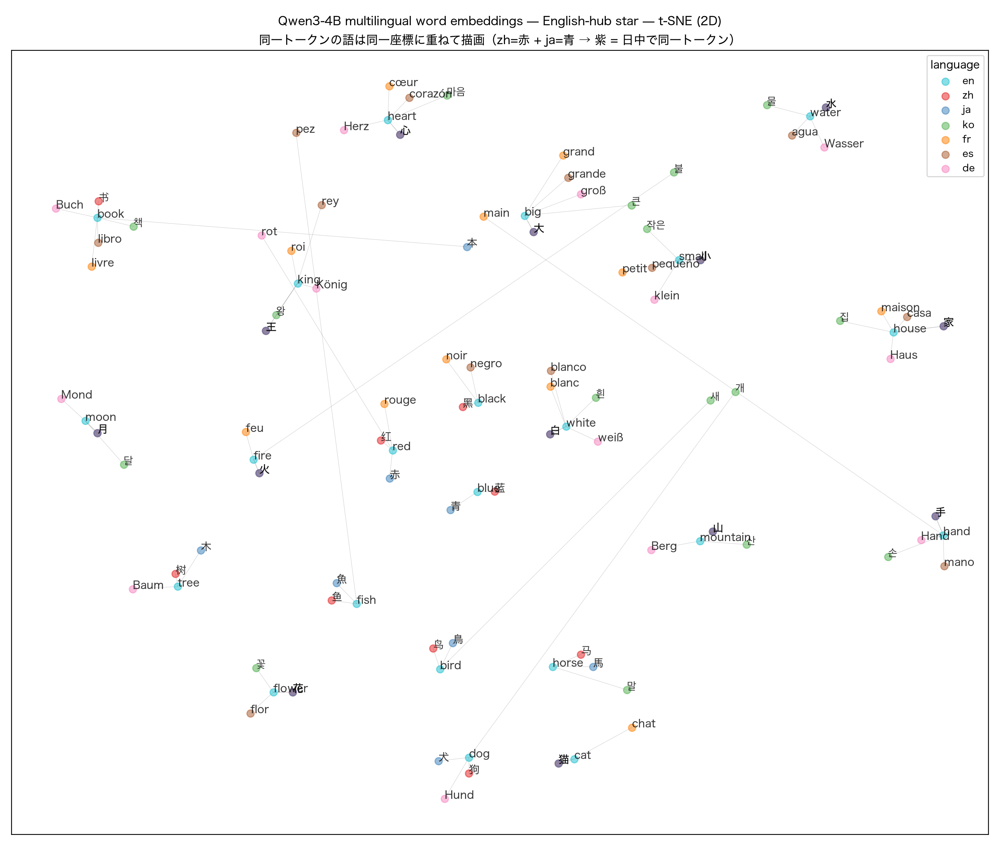
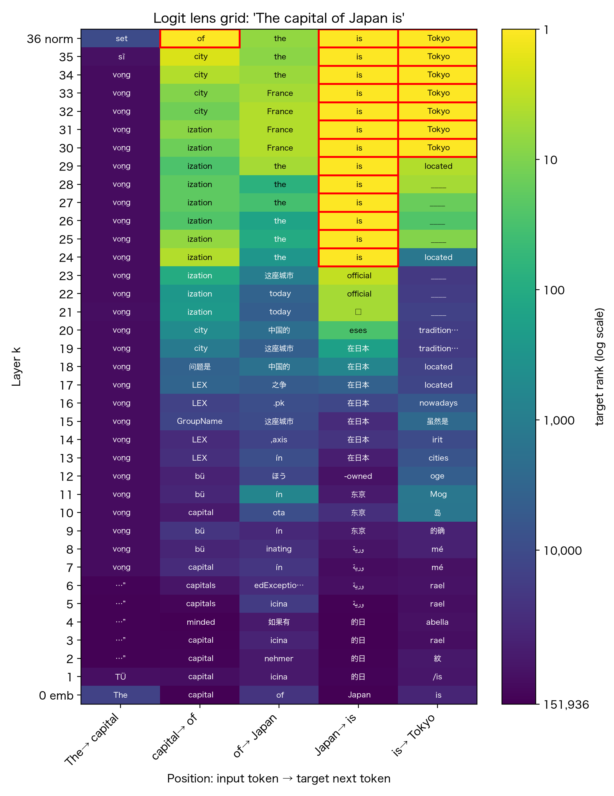
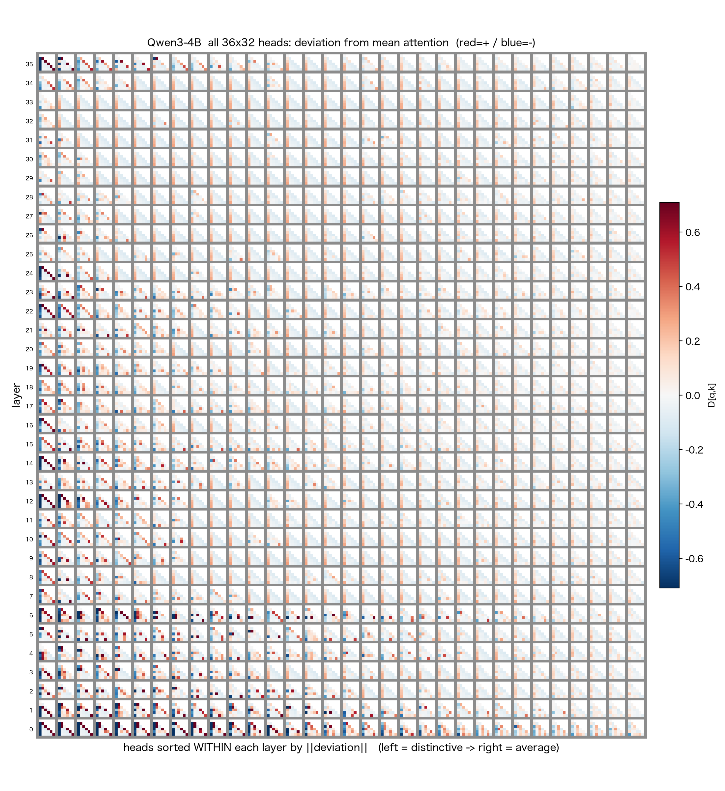

# qwen3_4b_probe

Qwen3-4B を用いた LLM 内部の観察・可視化のための調査

[](multilingual_geometry.md)

**Figure 1**: Qwen3-4B のトークン埋め込み $W_E$ から測った 38 言語の階層クラスタリング（Ward 法、距離＝ $\sqrt{1-\text{言語間の平均コサイン類似度}}$）。**英語は自分の語族（Germanic）から離れ、中国語・日本語・韓国語の塊に入り、英語–中国語が最も近い**。これは言語の系統では説明できず、学習データで中国語・英語が主要言語であることを反映したものと見られる（英語ピボット辞書と選択基準の影響は分離できていない）。多言語の対応を「回転（直交変換）」の合成とみると、概念先行・言語先行・加法の 3 モデルのうち概念先行モデルが最もよく支持され、逆概念変換で言語構造が顕在化すること等の詳細は → **[Qwen3-4B のトークン埋め込みに刻まれた多言語構造](multilingual_geometry.md)**（English: [multilingual_geometry_en.md](multilingual_geometry_en.md)）。


**Figure 2**: en→L の「転移性能」（英語→各言語へ回転 $R(L)$ ひとつで移せる度合い、 $R(L)$ の推定に使っていない held-out 対訳で測定）を、英語との生のコサイン $m_{en,L}$ に対して散布図にしたもの（各点＝1 言語、色＝言語グループ）。両者は強く相関する（Pearson $r=0.83$, Spearman $\rho=0.87$）が完全一致せず、**Romance（es, pt, fr）は生の近さの割に転移が上位**。生の近さと「回転ひとつで別言語へ移せる度合い」は別物であることを示す。図はノート [multilingual_geometry_demo.ipynb](lecture/multilingual_geometry_demo.ipynb) の Part 2.2 で生成。



**Figure 3**: Qwen3-4B の語彙埋め込み $W_E$ を「単語ベクトル」として見た図（t-SNE 2D）。同じ概念を 7 言語（英語・中国語・日本語・韓国語・フランス語・スペイン語・ドイツ語）で用意し、英語をハブとして、単語ごとに単一トークンになる言語だけを英語へリンクした。意味のまとまりが言語をまたいで形成される。これは Figure 4 の Logit Lens で英語プロンプトの内部に中国語トークンが顔を出すこととも整合的。中国語=赤・日本語=青で、共通漢字（山・火 など）は日中で同一トークンのため同座標に重なり紫になる。図はノート [02_residual_stream_logit_lens_patching.ipynb](lecture/02_residual_stream_logit_lens_patching.ipynb) の §6 で生成。



**Figure 4**: Qwen3-4B の Logit Lens。プロンプト「The capital of Japan is」で、各層（縦軸：下＝埋め込み〜上＝最終層）の residual stream を出力埋め込みで語彙へ射影し、各位置（横軸：入力トークン→次トークン）の top 予測トークンを表示。色は正解トークンの順位（対数スケール、黄＝1位）。最終列「is→Tokyo」では層 30 付近から Tokyo が 1 位に立ち上がる。面白いのは「Japan→is」列で、中間層に東京・日本に関わる語が顔を出し、しかもそれが**中国語**であること（簡体字「东京」— 日本語の「東京」と字形が異なる — や「在日本」）。表層形「is」へ収束する前に、モデルが内部では日本に関する概念を中国語経由で扱っている様子がうかがえる。図はノート [02_residual_stream_logit_lens_patching.ipynb](lecture/02_residual_stream_logit_lens_patching.ipynb) の §8 で生成。



**Figure 5**: Qwen3-4B の全 36 層 × 32 ヘッド（計 1152 個）の self-attention matrix を 1 枚に敷き詰めた図（プロンプト「The capital of Japan is Tokyo」）。各セルは attention 重みそのものではなく、全ヘッド平均からの差分 D[q,k]（赤＝平均より強く見る／青＝弱い／白＝平均通り）で、共通成分（causal な三角形と先頭トークンへの sink）を差し引くと各ヘッド固有の注目パターンが残る。縦軸は層（下＝入力側 0／上＝出力側 35）、横方向は各層内でヘッドを「平均からの距離」の大きい順に並べ替え（左＝個性的／右＝平均的）。多くのセルに見える赤い副対角は直前トークンを見る previous-token ヘッド。入力側の層ほど個性的なヘッドが多く、出力側は平均に近づく。中盤 L22–24 付近に現れる個性的なヘッドの帯は、activation patching が「Tokyo の決定は L24 付近」と示す層と重なる。図はノート [02_residual_stream_logit_lens_patching.ipynb](lecture/02_residual_stream_logit_lens_patching.ipynb) の §10 で生成。

## Purpose

Hugging Face Transformers の既存 API を使って、Qwen3-4B の内部計算（hidden states / attention / logits / residual stream など）を観察・可視化するための probe workspace。
主成果物は `lecture/` 配下の Jupyter Notebook 群で、各ノートは単体で完結する設計。
`scripts/` はその前段・周辺で行った調査スクリプト群、`docs/` には完成版の実験レポート md が置かれている。

## Model

- 主対象: `Qwen/Qwen3-4B`
- 比較対象（nb02 派生 / docs/16 / docs/17）: `Qwen/Qwen3-1.7B`, `Qwen/Qwen3-8B`（および Base 系）

## Repository structure

主な公開物は `lecture/`（ノート本編）と `rendered/`（output 込みの実行済み版）。ほかに `scripts/`（番号付き probe script 群）・`docs/`（実験レポート md + `docs/images/`）・`images/`（README 図）。

作業用の gitignore ディレクトリ（`outputs/ runs/ notes/ scratch/`）を含む全ディレクトリの役割・作業方針は [CLAUDE.md](CLAUDE.md) の「リポジトリ構成」を参照。

---

## Notebooks（Mac / Win / Colab）

`aidemo2026` venv で動作。各ノートは外部 script に依存せず単体で実行できる。実行前のノートの他に、実行済み版と Colab で実行できるリンクを付けてある。Colab実行する場合、GPU が要るノートは「ランタイムのタイプを変更」で選択する。

- **[00_intro_chat.ipynb](lecture/00_intro_chat.ipynb)**
  Qwen3-4B の読み込み、tokenizer / chat template、シングル・マルチターン chat、greedy decode による動作確認。

  [実行結果を見る](rendered/00_intro_chat.ipynb)・[](https://nbviewer.org/github/shimosan/qwen3_4b_probe/blob/main/rendered/00_intro_chat.ipynb)・[](https://colab.research.google.com/github/shimosan/qwen3_4b_probe/blob/main/lecture/00_intro_chat.ipynb)（GPU・無料 T4 可）

- **[01_tokenizer.ipynb](lecture/01_tokenizer.ipynb)**
  文字コード（Unicode / UTF-8）の基礎、tokenizer の `encode` / `decode`、token 分割の観察、特殊トークン。

  [実行結果を見る](rendered/01_tokenizer.ipynb)・[](https://nbviewer.org/github/shimosan/qwen3_4b_probe/blob/main/rendered/01_tokenizer.ipynb)・[](https://colab.research.google.com/github/shimosan/qwen3_4b_probe/blob/main/lecture/01_tokenizer.ipynb)（CPU で可）

- **[02_residual_stream_logit_lens_patching.ipynb](lecture/02_residual_stream_logit_lens_patching.ipynb)**（Qwen3-4B 版、主）
  入口（embedding）と出口（`lm_head` + softmax）の対応、residual stream と `hidden_states` の関係、Logit Lens、Activation Patching。

  [実行結果を見る](rendered/02_residual_stream_logit_lens_patching.ipynb)・[](https://nbviewer.org/github/shimosan/qwen3_4b_probe/blob/main/rendered/02_residual_stream_logit_lens_patching.ipynb)・[](https://colab.research.google.com/github/shimosan/qwen3_4b_probe/blob/main/lecture/02_residual_stream_logit_lens_patching.ipynb)（GPU・無料 T4 可）

- **[02_residual_stream_logit_lens_patching_qwen3_1p7b.ipynb](lecture/02_residual_stream_logit_lens_patching_qwen3_1p7b.ipynb)**（1.7B 派生版）
  nb02 と同じ実験を Qwen3-1.7B（Instruct）で実施、4B との結果差分を確認。

  [](https://colab.research.google.com/github/shimosan/qwen3_4b_probe/blob/main/lecture/02_residual_stream_logit_lens_patching_qwen3_1p7b.ipynb)（GPU・無料 T4 可）

- **[02_residual_stream_logit_lens_patching_qwen3_8b.ipynb](lecture/02_residual_stream_logit_lens_patching_qwen3_8b.ipynb)**（8B 派生版）
  nb02 と同じ実験を Qwen3-8B（Instruct）で実施、4B との結果差分を確認。

  [](https://colab.research.google.com/github/shimosan/qwen3_4b_probe/blob/main/lecture/02_residual_stream_logit_lens_patching_qwen3_8b.ipynb)（L4 必須・無料 T4 不可）

- **nb03（予定）** — attention / SAE / transcoder 系の可視化。現在 `scripts/06, 14, 15, 15b` で個別実験中（[後述](#scripts)）。

### 単語ベクトル / 埋め込み入門（別テーマ・Qwen 非依存）

- **[wordvec_demo.ipynb](lecture/wordvec_demo.ipynb)**
  学習済み単語ベクトル **GloVe**（`gensim` 経由）の入門ノート。「単語＝ベクトル」「コサイン類似度＝なす角」「意味の足し引き（`king − man + woman ≈ queen` / `Tokyo − Japan + France ≈ Paris`）」「PCA / t-SNE / UMAP 可視化」「埋め込みの限界（多義語・社会的バイアス）」を手元で再現する。Qwen 本体とは別テーマ（意味表現・単語埋め込みの入門）で、**ノート冒頭セルが必要パッケージ（gensim / scikit-learn / matplotlib / umap-learn）を自動 install** するため `aidemo2026` 以外（Colab 含む）でもそのまま動く。

  [実行結果を見る](rendered/wordvec_demo.ipynb)・[](https://nbviewer.org/github/shimosan/qwen3_4b_probe/blob/main/rendered/wordvec_demo.ipynb)・[](https://colab.research.google.com/github/shimosan/qwen3_4b_probe/blob/main/lecture/wordvec_demo.ipynb)（CPU で可）

### 多言語の語彙埋め込み幾何（Qwen3-4B $W_E$）

- **[multilingual_geometry_demo.ipynb](lecture/multilingual_geometry_demo.ipynb)**
  Qwen3-4B の共有トークン埋め込み $W_E$（151936×2560）を **1 枚だけ**読み、多言語がどう配置されているかを可視化するノート。モデル本体（40 億パラメータ）は動かさないのでメモリは軽い。MUSE 対訳辞書（en-XX 44 言語）で言語類似度・階層クラスタリング・上位 $k$ 近傍類似度を見ると、**英語は語族（Germanic）でなく中国語・日本語・韓国語（CJK）と束ねられ、英語ピボット型データ上で英語–中国語が最も近い**。さらに言語ごとの直交変換 $R(L)$ を対訳ペアから推定し、**概念先行・言語先行・加法の 3 モデルのうち概念先行モデルが最もよく支持される**こと（逆概念変換 $C_L^{-1}$ で概念成分を打ち消すと言語構造が顕在化し、順序を入れ替えた言語先行モデルや加法モデルではそうならないこと）を図と数値で確かめる。Part 5 に関連研究と位置づけ。**ノート冒頭セルが必要パッケージ／CJK フォントを自動整備**するため Mac / Win / Colab のいずれでも日中韓・アラビア/ヘブライのラベルが正しく描画される。

  [実行結果を見る](rendered/multilingual_geometry_demo.ipynb)・[](https://nbviewer.org/github/shimosan/qwen3_4b_probe/blob/main/rendered/multilingual_geometry_demo.ipynb)・[](https://colab.research.google.com/github/shimosan/qwen3_4b_probe/blob/main/lecture/multilingual_geometry_demo.ipynb)（CPU で可）

---

## Setup（notebook 用）

`aidemo2026` venv（**Python 3.12 系を使用。手元の基準は 3.12.10**）を作成し、必要なパッケージを入れ、モデル重みを Hugging Face cache に取得する:

```bash
# Python は 3.12 系を使う（基準 3.12.10）。まず `python3 --version` で確認:
#  A) 3.12 系ならそのまま下の `python3 -m venv ...` を実行する。
#  B) 3.12 系でない / 3.12.10 に厳密に揃えたいなら pyenv で入れ、その python で venv を作る:
#       pyenv install 3.12.10
#       ~/.pyenv/versions/3.12.10/bin/python -m venv ~/.venvs/aidemo2026   # ← 下行の代わりにこれ
python3 -m venv ~/.venvs/aidemo2026
source ~/.venvs/aidemo2026/bin/activate
pip install -U pip wheel
# torch は OS/GPU で入れ方が違うので先に入れる（版は固定しない）:
pip install torch torchvision                 # Mac (Apple Silicon) / GPU 無し(CPU)
# NVIDIA GPU (CUDA 12.8) の場合: pip install torch torchvision --index-url https://download.pytorch.org/whl/cu128
pip install -r requirements.txt
python scripts/01_download_model.py
```

モデルダウンロードは初回のみで約 8 GB（fp16）。後続の notebook 起動時は HF cache から読み出されます。

> **Colab で動かす場合はこの setup は不要**です。torch 等は最初から入っており、各ノート冒頭の「環境セットアップ」セルが Colab を自動判定して必要分だけ `!pip install` します。ノートを開いて「ランタイム → すべて実行」するだけです。

> **補足**: activate 後にプロンプトが `((aidemo2026) )` と二重括弧になる場合、`python3 scripts/fix_venv_prompt.py ~/.venvs/aidemo2026` で単一括弧に直せます（見た目だけの問題で動作には無影響）。使い方や仕組みはスクリプト冒頭のコメント参照。

## Notebook の開き方

setup 完了後、`aidemo2026` venv を activate して Jupyter を起動するか、VS Code / Cursor で `.ipynb` を直接開きます。

### 方法 A — Jupyter Lab

```bash
source ~/.venvs/aidemo2026/bin/activate
cd lecture
jupyter lab
```

ブラウザが開いたら、`00_intro_chat.ipynb` などをクリックして実行。カーネルは起動した `aidemo2026` venv の Python（汎用の `python3` カーネル）がそのまま使われます。

### 方法 B — VS Code / Cursor

`.ipynb` ファイルを直接開けば Jupyter 拡張が起動します。右上の「カーネル選択」から `aidemo2026` (`~/.venvs/aidemo2026/bin/python`) を選択。cwd は自動で notebook と同じディレクトリに設定されます。

### 初回実行時の注意

- 最初のセル（model load）は **数十秒〜数分**かかります（モデルを RAM に展開するため）。
- Mac (M シリーズ) では MPS が自動で選ばれます。CUDA 環境では CUDA が選ばれます。何も使えなければ CPU fallback。
- ノートの kernelspec は汎用の `python3` を指しているので、**特別なカーネル登録は不要**です。VS Code / Cursor では `aidemo2026` venv の Python を、Jupyter Lab では起動した venv を選べばそのまま動きます（Colab は無関係）。

---

# Advanced — scripts と experiment reports

ここから下は、lecture の前段・周辺で実施した調査スクリプトおよび実験レポートに関する情報。**ノートを動かすだけなら不要**で、内部の経緯や個別実験の詳細を追いたい人向けです。

## Scripts

`scripts/` は時系列的に **3 つのフェーズ**に分かれている:

### フェーズ 1 — Qwen3 動作確認・基本 probe（scripts 00–06、2026-05-07 〜 08）

Notebook 作成前に行った、Qwen3-4B の動作確認・環境セットアップ・基本的な内部状態 probe。**個々の script を notebook に統合してはおらず、ノート全体の前提知識として吸収**された。`aidemo2026` venv で動作。

詳細レポートは 1 本にまとめてある: **[docs/00-06_setup_and_basic_probe.md](docs/00-06_setup_and_basic_probe.md)**（7 chapter 構成）。

### フェーズ 2 — nb02 のための事前探査（scripts 07–12、2026-05-11 〜 15）

「residual stream を観察・介入する」notebook 02 を書くために、**各テーマを個別に動作確認した prelim script** 群。`llm2026-dev` venv で動作。これらの実験成果が最終的に nb02 の各セクション (logit lens / activation patching / embedding 解析) に統合された。

各 script ごとに個別 docs/ 化済み: **[docs/07_*.md](docs/07_hidden_state_mapping.md) 〜 [docs/12_*.md](docs/12_residual_stream_patching.md)**。

### フェーズ 3 — nb03（予定）のための個別実験（scripts 06, 14–17, 19、2026-05-08 / 18 〜 21）

community SAE / transcoder / attention 解析の周辺実験。**nb03 にまだ統合されておらず**、各 script が独立した実験として `docs/` に 1:1 でレポート化されている。`llm2026-dev` venv（06 のみ `aidemo2026`）。

- 06: 基本 attention heatmap（フェーズ 1 に時系列では属するが、nb03 attention 可視化の予備として位置づけ）
- 14, 15, 15b: mwhanna MLP transcoder（4B、layer 23-25 詳細 + 全 36 layer sweep）
- 16, 17: Qwen-Scope 公式 residual SAE（1.7B-Base layer 20 / 8B-Base layer 24）
  - **注**: 検討の結果、これらの SAE は nb03 には**含めない方針**。Base モデル前提・4B 不在のため入門デモには不適と判断（詳細は [docs/16](docs/16_qwenscope_sae_qwen3_1p7b_layer20.md) / [docs/17](docs/17_qwenscope_sae_qwen3_8b_layer24.md) 冒頭の callout 参照）。レポートだけ残してある。
- 19: attention 総合 probe（4B、attention weights / head scoring / residual update / component-level activation patching）。attention 可視化の部分は nb02 §10 に発展。深い head 同定・component patching は nb03 予定分。レポートは暫定版（未検証、[docs/19](docs/19_qwen3_4b_attention_probe.md)）。

13・18 番は欠番。

### Script → Notebook 対応表

`#` が script 番号、`Script` 列が拡張子なしの短縮名（リンク先はフルファイル名）。

| # | Script | Notebook | 関連内容 |
|---|---|---|---|
| 00 | [env_check](scripts/00_env_check.py) | 共通基盤 | 環境（torch / transformers / MPS）の確認 |
| 01 | [download_model](scripts/01_download_model.py) | 共通基盤 | モデル重みを HF cache に取得 |
| 02 | [tokenizer_probe](scripts/02_tokenizer_probe.py) | **nb01** | tokenizer / chat template の token 表 |
| 03 | [generate_smoke](scripts/03_generate_smoke.py) | **nb00** | 短い日本語応答の greedy 生成 |
| 04 | [probe_forward](scripts/04_probe_forward.py) | **nb02**（基礎） | `output_hidden_states` / `output_attentions` の shape 確認、next-token 分布 |
| 05 | [show_transformers_source](scripts/05_show_transformers_source.py) | 共通基盤 | `modeling_qwen3.py` のパス表示ユーティリティ |
| 06 | [attention_heatmap](scripts/06_attention_heatmap.py) | **nb03**（予備） | layer 0 head 0 の attention 可視化 |
| 07 | [hidden_state_mapping](scripts/07_hidden_state_mapping.py) | **nb02** | hook 出力と `output_hidden_states` の一致確認 |
| 08 | [logit_lens](scripts/08_logit_lens.py) | **nb02** | 各層 hidden state に `lm_head` を当てる logit lens |
| 09 | [embedding_unembedding](scripts/09_embedding_unembedding.py) | **nb02** | $W_E$ / $W_U$ の関係、tie_word_embeddings、PCA / t-SNE |
| 10 | [compare_logit_lens_transformerlens](scripts/10_prelim_compare_logit_lens_transformerlens.py) | **nb02**（検証）| 自前 logit lens vs TransformerLens（fp16） |
| 11 | [compare_logit_lens_float32](scripts/11_prelim_compare_logit_lens_float32.py) | **nb02**（検証）| 同上の fp32/CPU 完全一致確認 |
| 12 | [residual_stream_patching](scripts/12_residual_stream_patching.py) | **nb02** | Tokyo/Paris activation patching |
| 14 | [qwen3_4b_transcoder_smoke](scripts/14_prelim_qwen3_4b_transcoder_smoke.py) | **nb03**（予定） | mwhanna MLP transcoder × Qwen3-4B layer 23/24/25 詳細 |
| 15 | [qwen3_4b_transcoder_layer_sweep](scripts/15_prelim_qwen3_4b_transcoder_layer_sweep.py) | **nb03**（予定） | 同上、全 36 layer sweep |
| 15b | [qwen3_4b_transcoder_layer_sweep_replots](scripts/15b_qwen3_4b_transcoder_layer_sweep_replots.py) | **nb03**（予定） | 15 結果の再 plot |
| 16 | [qwenscope_sae_smoke](scripts/16_prelim_qwenscope_sae_smoke.py) | nb03 不採用 | Qwen-Scope SAE × Qwen3-1.7B-Base layer 20（レポートのみ） |
| 17 | [qwenscope_sae_8b_smoke](scripts/17_prelim_qwenscope_sae_8b_smoke.py) | nb03 不採用 | 同上、Qwen3-8B-Base layer 24（レポートのみ） |
| 19 | [prelim_attention_probe](scripts/19_prelim_attention_probe.py) | nb02 §10 / nb03（予定） | attention weights・head scoring・residual update・component patching（レポート暫定版） |

### Setup（scripts 用、07 以降）

scripts 07 以降は `llm2026-dev` venv が必要（notebook 用 env に sklearn / transformer-lens / safetensors 経由の community SAE 等の追加依存を足したもの。共通環境 `aidemo2026-dev` への統合は未定のため、現状は `llm2026-dev` を使う）:

```bash
python3 -m venv ~/.venvs/llm2026-dev
source ~/.venvs/llm2026-dev/bin/activate
pip install -U pip wheel
pip install -r requirements-dev.txt
```

### Scripts の使い方

`scripts/` 配下の番号付きスクリプトは、どこから実行しても動作する（出力先はプロジェクトルート直下の `outputs/` に解決される）。

```bash
# フェーズ 1（00–06）は aidemo2026 venv で
source ~/.venvs/aidemo2026/bin/activate
python scripts/00_env_check.py
python scripts/04_probe_forward.py
python scripts/06_attention_heatmap.py --head 0 --label-mode piece

# フェーズ 2 以降（07–）は llm2026-dev venv で
source ~/.venvs/llm2026-dev/bin/activate
python scripts/08_logit_lens.py
python scripts/12_residual_stream_patching.py
```

実行順序や依存関係（例: 06 は 04 の後に実行）は [CLAUDE.md](CLAUDE.md) と [docs/00-06_setup_and_basic_probe.md](docs/00-06_setup_and_basic_probe.md) を参照。

## Notebook を編集して commit する場合（開発者向け）

ノートを動かすだけなら不要だが、`.ipynb` に変更を加えて git commit する人は、**clone 直後に 1 回**以下を実行する:

```bash
source ~/.venvs/aidemo2026/bin/activate
nbstripout --install --keep-id
```

これは `.git/config` に notebook 用 filter を登録し、`*.ipynb` の output セル（実行結果、画像、エラー出力）を **commit 時に自動的に除去**する設定です。`--keep-id` はセル UUID を保持するオプション（無いと毎回 ID が churning して diff が読みにくくなる）。

`pip install -r requirements.txt` では `nbstripout` パッケージ自体は入るが、git filter の登録は別操作。これを設定しないと出力付きノートをそのまま commit してしまい、リポジトリが肥大化する。

---

## Documentation map

実験レポート md は `docs/` 配下にある。**GitHub** または **`Cmd+Shift+V`（VS Code / Cursor の正規 Markdown Preview）** で読むのが最も見やすい（KaTeX 数式が render される）。Obsidian でも可。

- [CLAUDE.md](CLAUDE.md) — リポジトリ全体の作業方針（Claude Code 向けだが人間にも有用な記述）

フェーズ 1（scripts 00–06）— Qwen3 動作確認:
- [docs/00-06_setup_and_basic_probe.md](docs/00-06_setup_and_basic_probe.md) — 7 chapter まとめ（環境・tokenizer・forward・attention）

フェーズ 2（scripts 07–12）— nb02 のための事前探査:
- [docs/07_hidden_state_mapping.md](docs/07_hidden_state_mapping.md) — hook と `output_hidden_states` の一致確認
- [docs/08_logit_lens.md](docs/08_logit_lens.md) — 各層 hidden state に `lm_head` を当てる logit lens
- [docs/09_embedding_unembedding.md](docs/09_embedding_unembedding.md) — $W_E$ / $W_U$ の関係（tie_word_embeddings、effective unembedding）
- [docs/10_compare_logit_lens_transformerlens.md](docs/10_compare_logit_lens_transformerlens.md) — 自前実装 vs TransformerLens（fp16 環境）
- [docs/11_compare_logit_lens_float32.md](docs/11_compare_logit_lens_float32.md) — 同上の fp32/CPU 完全一致確認
- [docs/12_residual_stream_patching.md](docs/12_residual_stream_patching.md) — Tokyo/Paris activation patching

フェーズ 3（scripts 14–17）— nb03 のための個別実験:
- [docs/14_qwen3_4b_transcoder_layers23_24_25.md](docs/14_qwen3_4b_transcoder_layers23_24_25.md) — mwhanna MLP transcoder（layer 23/24/25 詳細）
- [docs/15_qwen3_4b_transcoder_layer_sweep.md](docs/15_qwen3_4b_transcoder_layer_sweep.md) — 同上の全 36 layer sweep
- [docs/16_qwenscope_sae_qwen3_1p7b_layer20.md](docs/16_qwenscope_sae_qwen3_1p7b_layer20.md) — Qwen-Scope SAE on Qwen3-1.7B-Base（nb03 不採用）
- [docs/17_qwenscope_sae_qwen3_8b_layer24.md](docs/17_qwenscope_sae_qwen3_8b_layer24.md) — 同上 on Qwen3-8B-Base（nb03 不採用）

## Notes

- このリポジトリでは Transformers ソースコードを改変しない（pip install 版を使う）。source-level の tracing / 改変が必要な場合は別の source-tracing 用 workspace（editable install）を使う。
- モデル重みは Hugging Face cache に置き、workspace 内には保存しない。

## 謝辞

本 workspace は以下の open-source プロジェクトと公開モデルに依拠している:

- **[Qwen3](https://huggingface.co/Qwen)** (Alibaba Cloud / Apache-2.0) — 主対象モデル `Qwen3-4B` および 1.7B / 8B 派生
- **[Transformers](https://github.com/huggingface/transformers)** (Hugging Face / Apache-2.0) — モデルローダー、tokenizer、`output_hidden_states` / `output_attentions` の API
- **[TransformerLens](https://github.com/TransformerLensOrg/TransformerLens)** (MIT) — logit lens 等の比較実装 ([docs/10](docs/10_compare_logit_lens_transformerlens.md), [docs/11](docs/11_compare_logit_lens_float32.md))
- **[mwhanna/qwen3-4b-transcoders](https://huggingface.co/mwhanna/qwen3-4b-transcoders)** (MIT) — Qwen3-4B 用 MLP transcoder weights ([docs/14](docs/14_qwen3_4b_transcoder_layers23_24_25.md), [docs/15](docs/15_qwen3_4b_transcoder_layer_sweep.md))
- **[Qwen-Scope](https://huggingface.co/kisate-team)** (Apache-2.0) — 公式 residual SAE checkpoint ([docs/16](docs/16_qwenscope_sae_qwen3_1p7b_layer20.md), [docs/17](docs/17_qwenscope_sae_qwen3_8b_layer24.md))
- **[GloVe](https://nlp.stanford.edu/projects/glove/)** (Stanford NLP / 学習済みベクトルは Open Data Commons PDDL) — `wordvec_demo.ipynb` が使う単語埋め込み `glove-wiki-gigaword-300`（Pennington, Socher, Manning. *GloVe: Global Vectors for Word Representation.* EMNLP 2014, [D14-1162](https://aclanthology.org/D14-1162/)）
- **[gensim](https://radimrehurek.com/gensim/)** (LGPL-2.1) — `wordvec_demo.ipynb` の学習済みベクトル取得（`gensim.downloader`）・最近傍計算

本 repository 自体は MIT License（[LICENSE](LICENSE)）で公開している。
