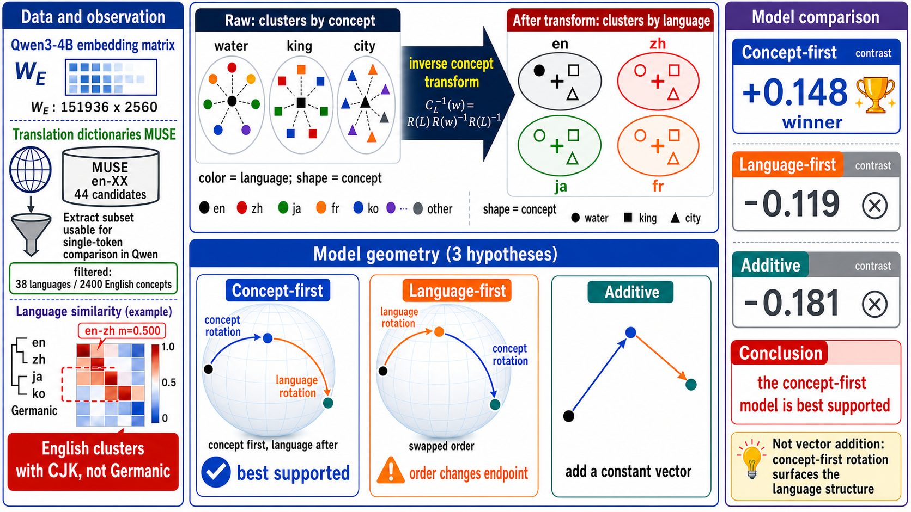
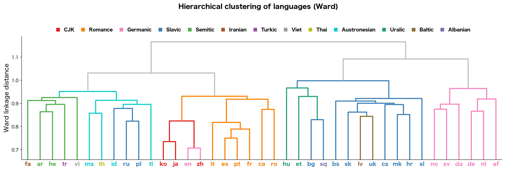
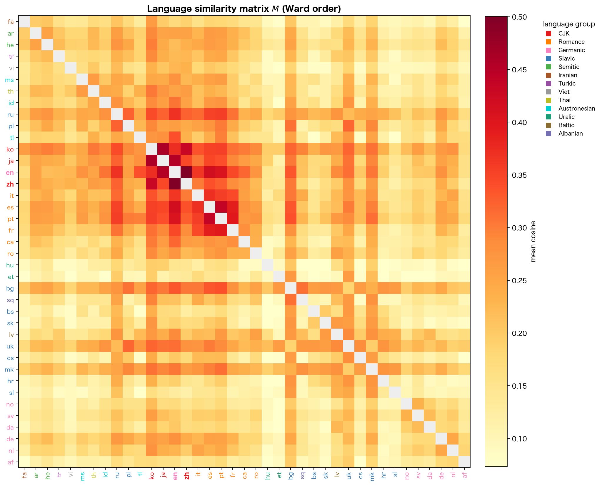
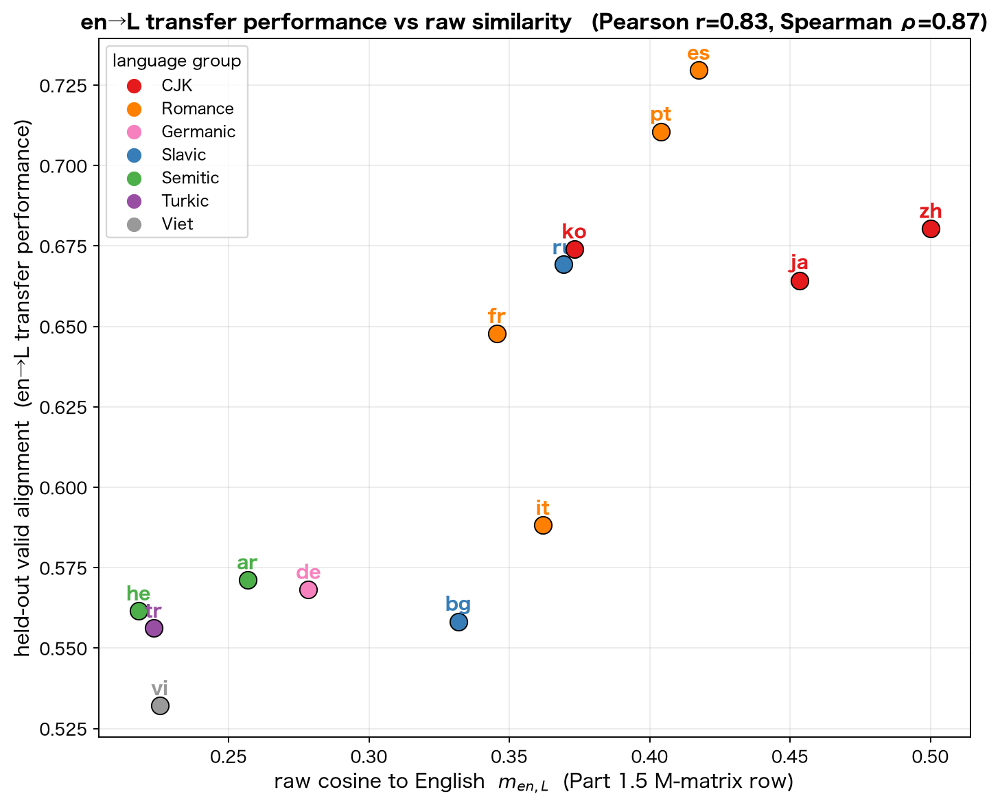
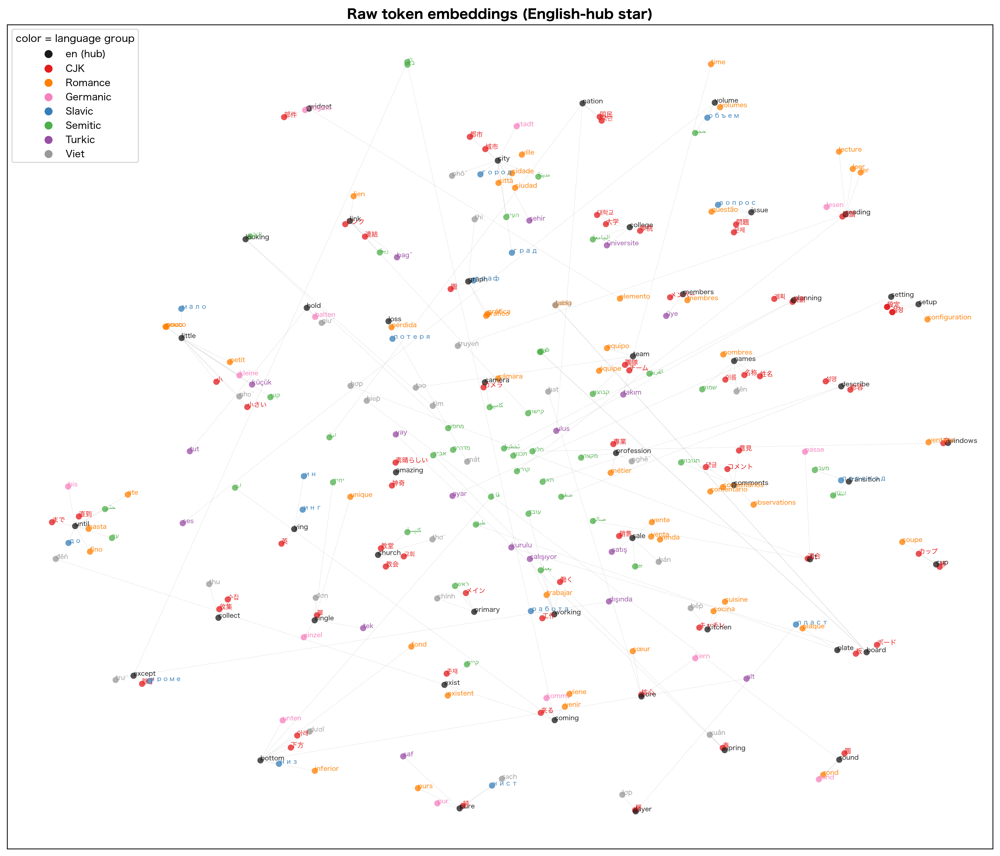
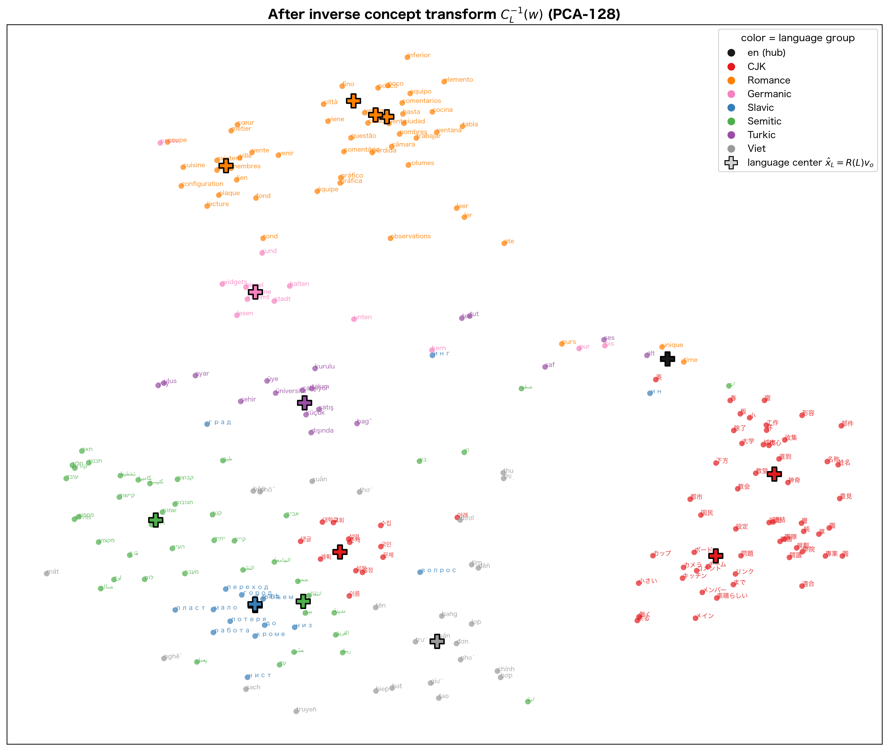

# Multilingual geometry encoded in Qwen3-4B's token embedding matrix

**日本語** → [Qwen3-4B のトークン埋め込みに刻まれた多言語構造](multilingual_geometry.md)

We observe the multilingual geometry encoded in the token embedding matrix of the multilingual model **Qwen3-4B** ($W_E$, $151936 \times 2560$, shared between input and output). We model each token's vector as the result of composing a "concept rotation" and a "language rotation," starting from a common reference direction (the rotation is, strictly, an orthogonal transform). By the order in which the rotations are composed we set up three models (the **concept-first model** $v_L(w)=R(L)R(w)v_o$, the **language-first model** $v_L(w)=R(w)R(L)v_o$, and the **additive model** $v_L(w)=v_\text{en}(w)+a_L$), and check with figures which one is best supported for $W_E$, using the bilingual dictionary **MUSE** (English-pivot en-XX, 44 languages). For Qwen3-4B's token embedding matrix, the concept-first model is better supported than the other two. When the concept-first model holds, a vector obtained in one language can be mapped to another by a single transform independent of concept (concept-independent language transfer).

For the detailed procedure, formulas, and related work, see the notebook itself:
[multilingual_geometry_demo_en.ipynb](lecture/multilingual_geometry_demo_en.ipynb) · [view the executed results](rendered/multilingual_geometry_demo_en.ipynb) ·  ·  (runs on CPU)

---

## 1. English departs from its own family and is bundled with CJK

**Figure 1**: hierarchical clustering of 38 languages (Ward linkage, distance = $\sqrt{1 - \text{mean cosine similarity between languages}}$). Leaf = language (color = language group), vertical axis = Ward linkage distance (lower = becomes one cluster earlier = closer). The point of interest is that **English (en) falls not into its own family Germanic (de, nl, af, sv, da, no) but into the cluster of Chinese, Japanese, and Korean (CJK)**. This cannot be explained by the languages' genealogy and appears to reflect Chinese and English being the main languages in Qwen's training data (though the effects of the English-pivot dictionary and the selection criteria are not separated out; Romance, Slavic, etc. mostly cluster by family).

## 2. A language similarity matrix where English–Chinese are closest

**Figure 2**: the language similarity matrix $M$ (each cell = the mean cosine similarity between two languages, darker red = larger, the diagonal is trivial so gray). Rows and columns are ordered by the Ward order of Figure 1, with labels colored by language group. ko-ja-en-zh form a dark red block, and the strongest cell is **English–Chinese** ($m = 0.500$). The row and column of English are broadly reddish across many language groups, so its hub-like behavior on this English-pivot data is visible from the matrix side too.

## 3. Transfer performance from English differs slightly from raw similarity

**Figure 3**: each point is one target language (color = language group). Horizontal axis = raw cosine to English $m_{en,L}$ (the $M$ row of Figure 2); vertical axis = the "transfer performance" from English to that language (the alignment measured on held-out translation pairs not used to estimate the rotation $R(L)$). The two correlate strongly (Pearson $r = 0.83$, Spearman $\rho = 0.87$) but do not fully coincide: **Romance (es, pt, fr) ranks higher in transfer than its raw closeness would suggest**, while CJK (zh, ja) has the largest raw closeness. Raw closeness and "how well one rotation carries a vector to another language (transferability)" are different things; the latter also reflects how easily a family aligns (the absolute values depend on the working space and pair selection, so read only the ranking and the deviation).

## 4. The raw embeddings cluster by meaning (a concept-dominated representation)

**Figure 4**: the raw embeddings (vectors with no transform applied) reduced to 2D by t-SNE (cosine distance). We draw **48 randomly chosen English words** and their translations in each language as a "star" connecting English (black = hub) at the center by thin lines (branch = English → translation; no arbitrary selection of only close words). **Same-meaning translations (in different languages) come close** to each other, while no region gathers only one language group. What determines closeness is meaning rather than language, so this raw embedding clusters by concept = a **concept-dominated representation**.

## 5. The inverse concept transform surfaces the language structure

**Figure 5**: after estimating, for each language, an orthogonal transform (rotation) $R(L)$ from the translation pairs and applying the **inverse concept transform** $C_L^{-1}(w) = R(L)\,R(w)^{-1}\,R(L)^{-1}$ that cancels the concept component, drawn with t-SNE (the same displayed concepts and languages as Figure 4, but the working space is PCA-128 rather than the raw 2560 dimensions; the English points coincide exactly with the reference $v_o$ under the inverse transform, so they are not drawn individually but are represented by the +). **The points cluster not by concept but by language (= color)**, and each language's center (large +) is placed far from the others = the language structure hidden in the raw embedding has surfaced. This change appears clearly only when building the conjugate transform under the concept-first model $v_L(w)=R(L)R(w)v_o$; it does not happen for the order-swapped language-first model, nor for the additive model that represents the language difference by a constant vector. The multilingual correspondence is well described not by "vector addition" but by a concept-first rotation (conjugate). That is this notebook's observation.
